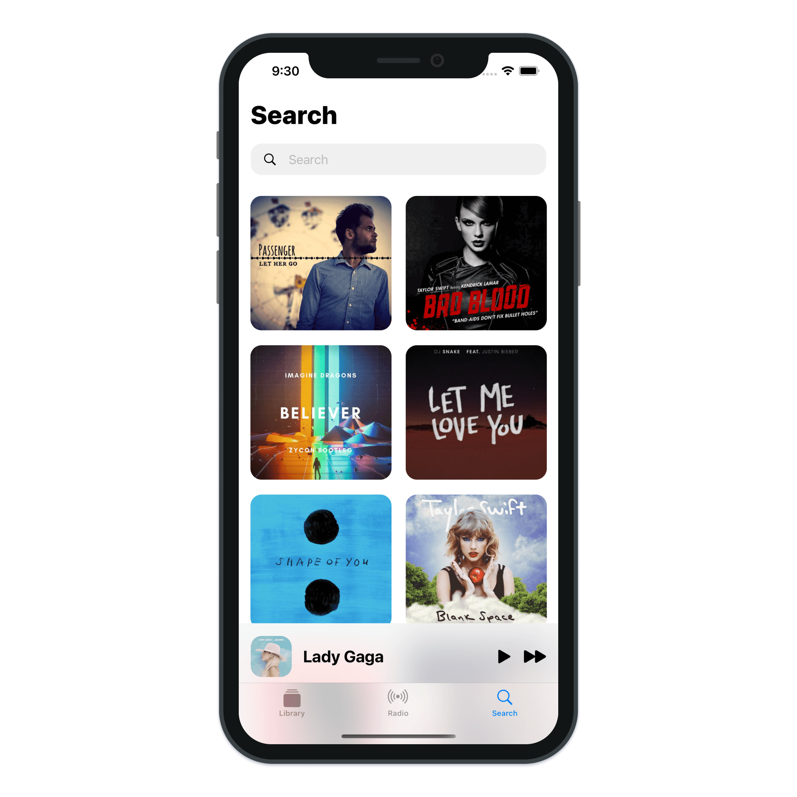
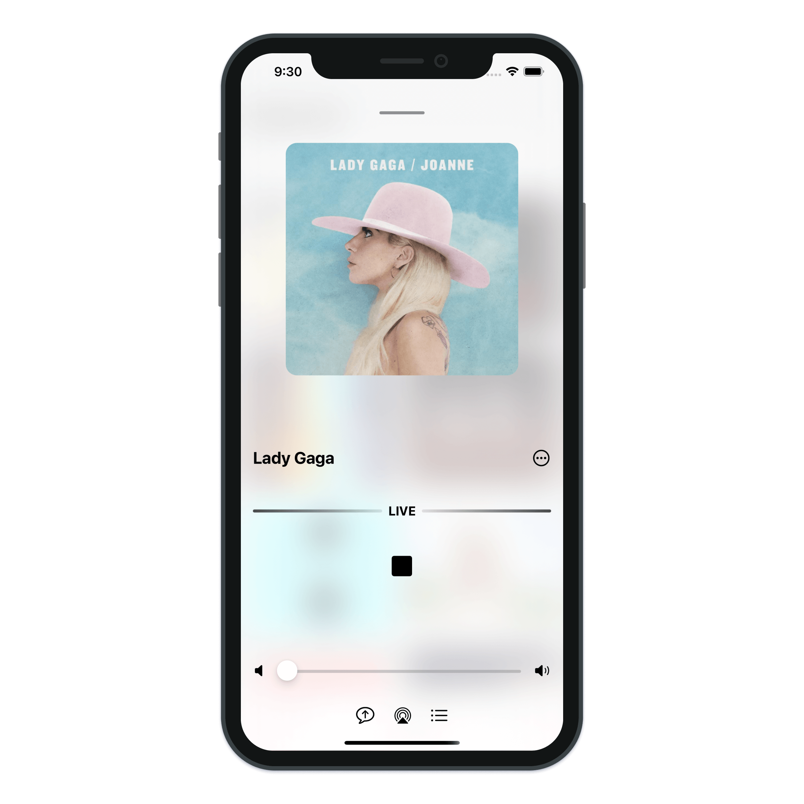
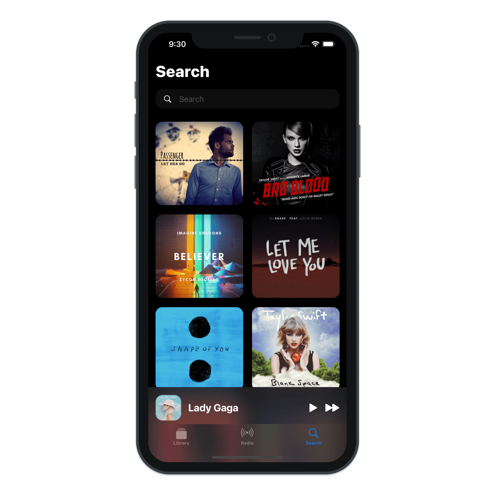
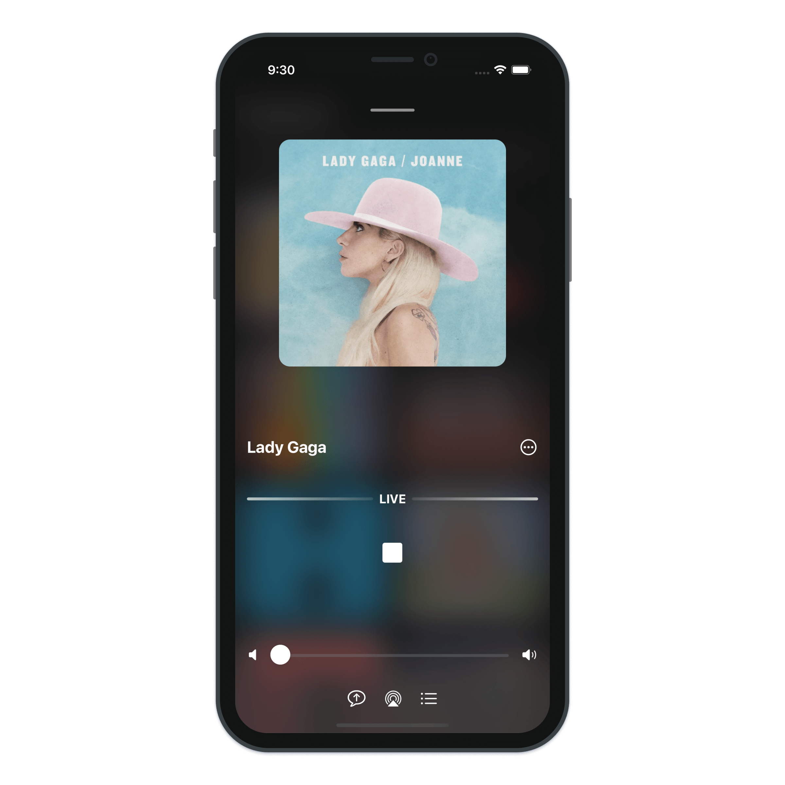

# Apple Music Animations

> Build a simple Music application with SwiftUI.

---

- SwiftUI 2.0 Transition
- SwiftUI 2.0 UIVisualEffectView
- SwiftUI 2.0 UIBlurEffect
- SwiftUI 2.0 Hero Animations
- SwiftUI 2.0 Matched Geometry Effect
- SwiftUI 2.0 Custom Animations
- SwiftUI 2.0 LazyGrids
- SwiftUI 2.0 Tab Bar
- Xcode 12 SwiftUI 2.0
