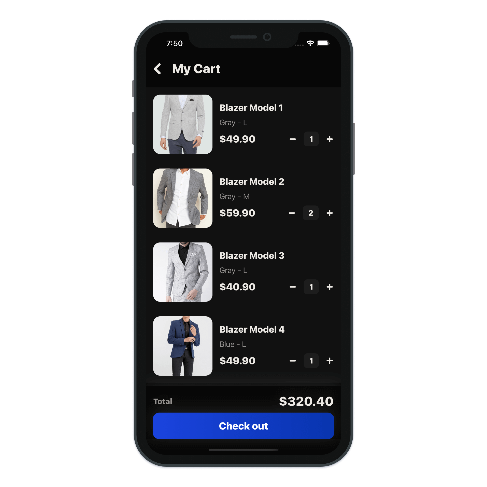
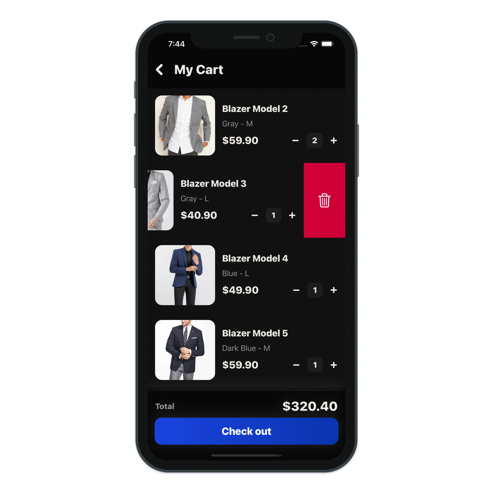
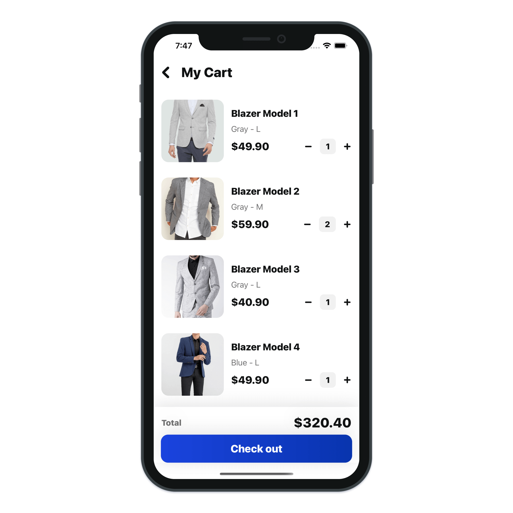
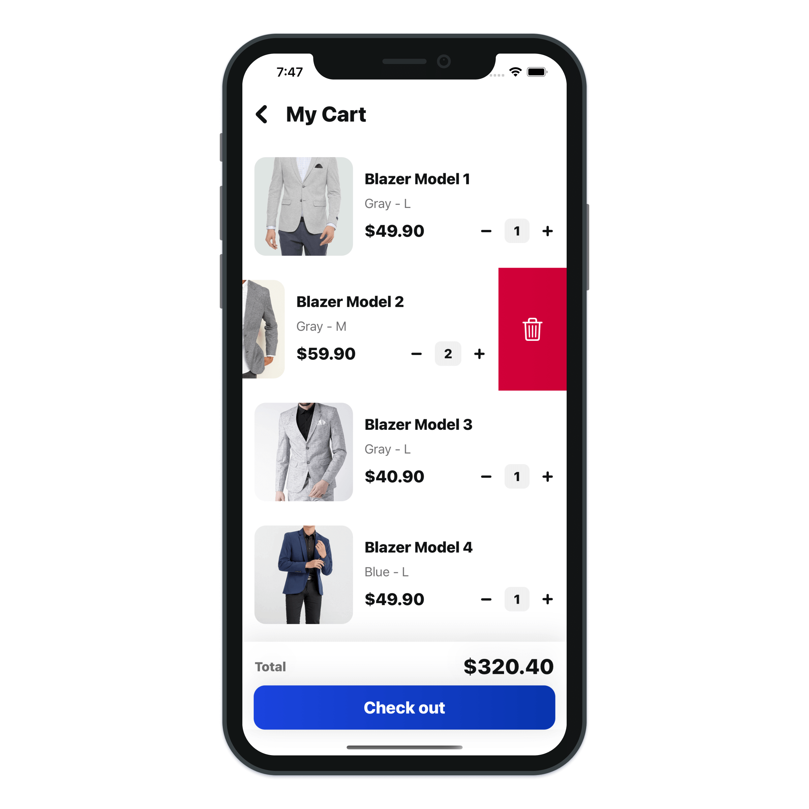

# Cart UI Swipe To Delete

> Build Cart user interface swipe to delete action with SwiftUI.

---

- SwiftUI Gestures
- SwiftUI Drag Gesture
- SwiftUI VStack
- SwiftUI HStack
- SwiftUI ZStack
- SwiftUI LinearGradient
- SwiftUI Animations
- SwiftUI TextView
- SwiftUI Button
- SwiftUI Spacer
- SwiftUI Shape
- SwiftUI Image
- Xcode 12 SwiftUI 2.0
