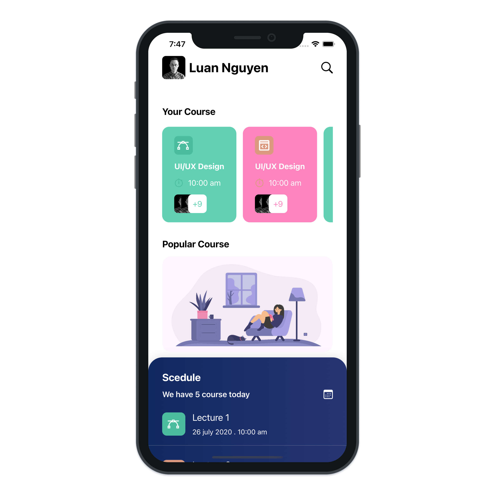
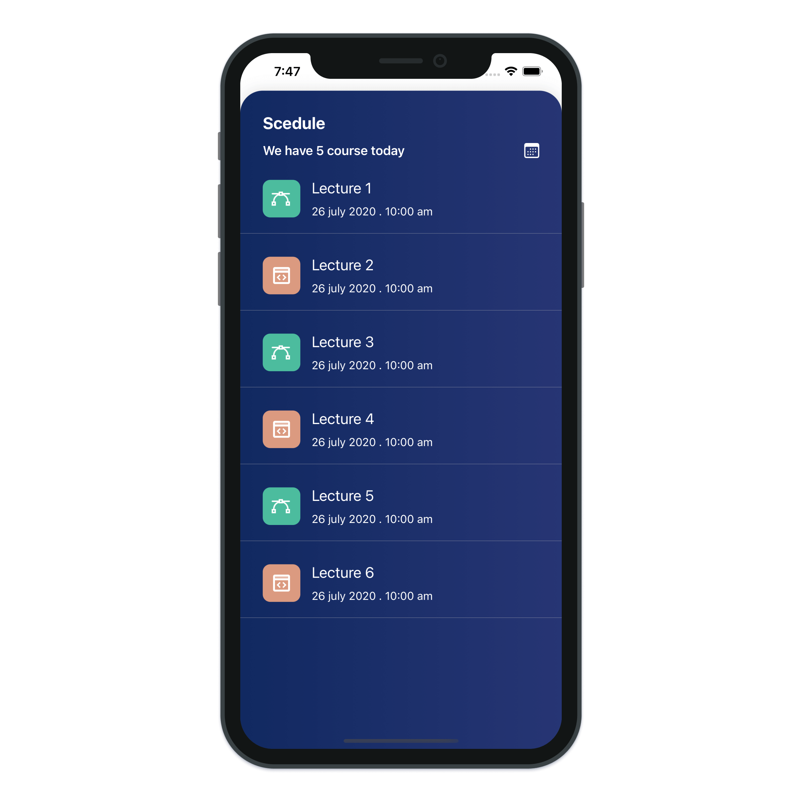

# Courses App

> Build a Courses application with SwiftUI.

---

- SwiftUI Gradient
- SwiftUI DragGesture
- SwiftUI LazyHGrid
- SwiftUI ZStack
- SwiftUI VStack
- SwiftUI HStack
- SwiftUI RoundedRectangle
- SwiftUI Text
- SwiftUI Spacer
- SwiftUI Button
- SwiftUI Image
- SwiftUI ScrollView
