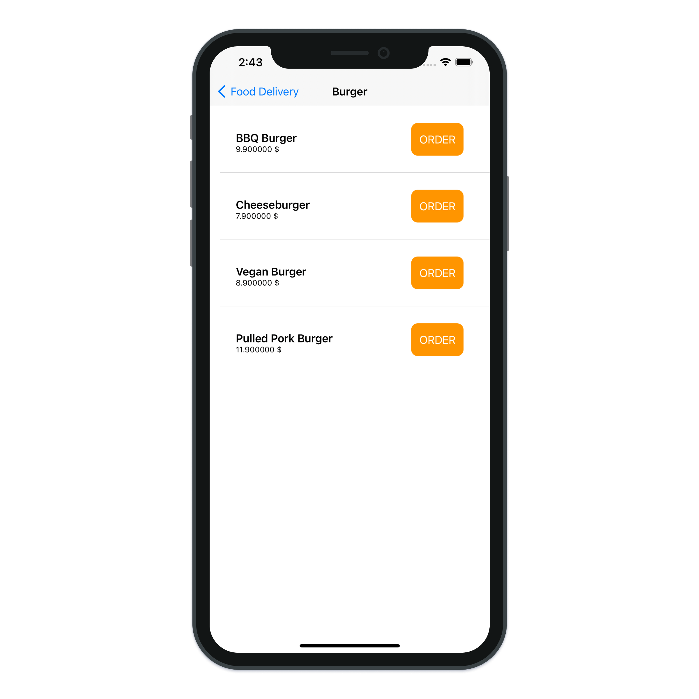
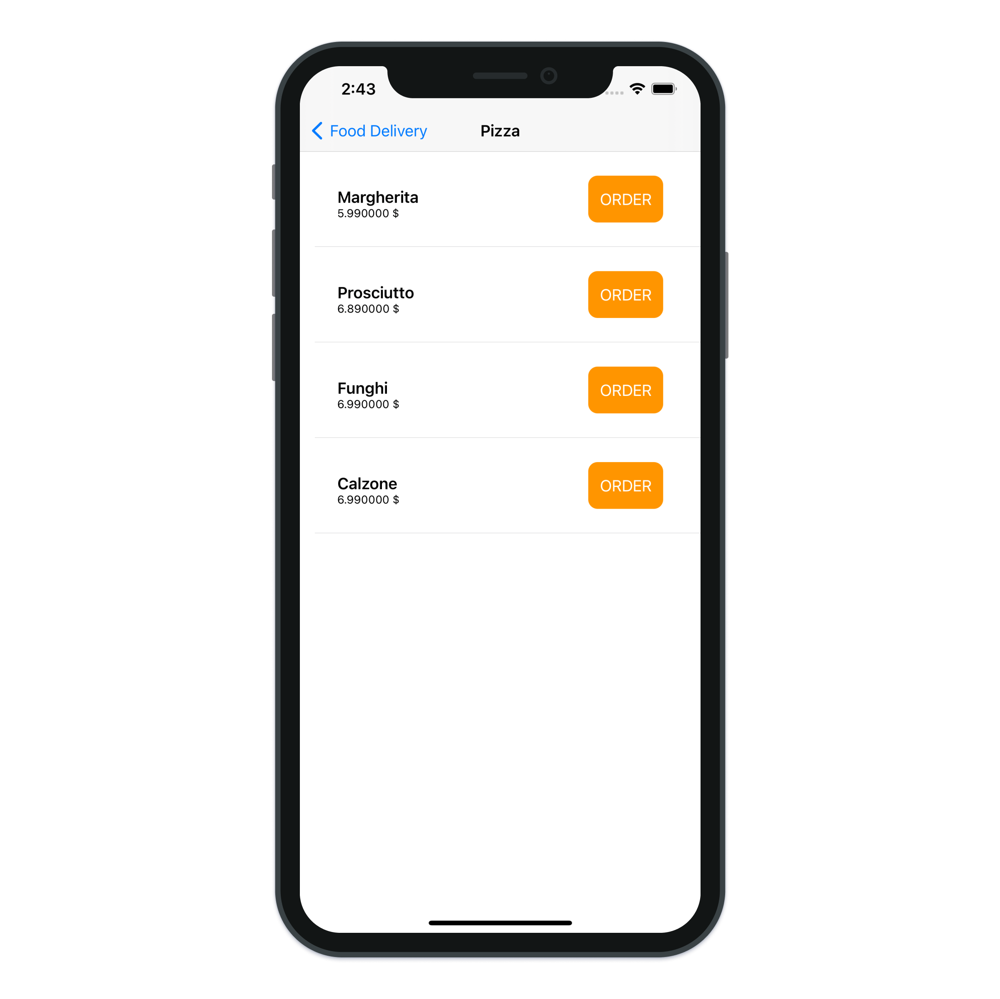
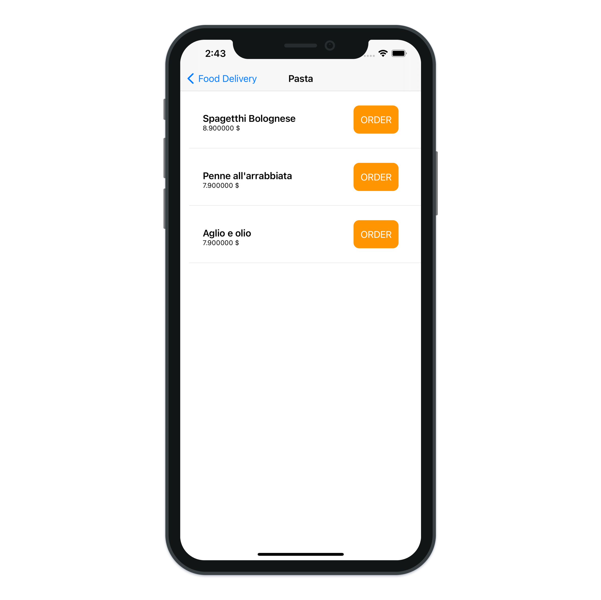
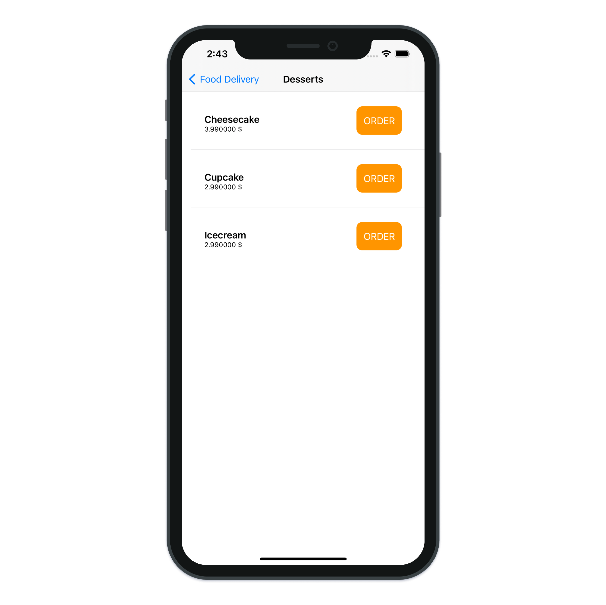

# Mastering Table Views (Lists)

> Learn how to use Tab View with SwiftUI.

---

- SwiftUI TableView
- SwiftUI Image
- SwiftUI VStack
- SwiftUI ZStack
- SwiftUI TextView
- SwiftUI List
- SwiftUI Spacer
- SwiftUI Data Model
- SwiftUI Button
- SwiftUI NavigationView

---

[SwiftUI – Mastering Table Views (Lists) #1](https://blckbirds.com/post/swiftui-mastering-table-views-lists-1/)

[SwiftUI – Mastering Table Views (Lists) #2](https://blckbirds.com/post/swiftui-mastering-table-views-lists-1-2/)
