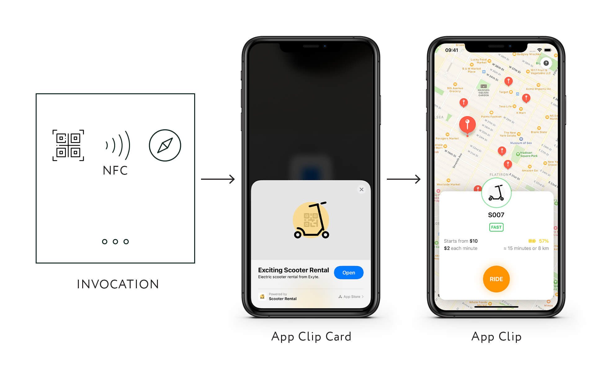

# App Clips

- The App Clip code does not use a standard QR or barcode. This means the codes are unique to Apple products.

- This means you have to use their service to generate the printed code, again limiting your scope.

- Only available to Apple iPhone owners (excludes Android and Windows users).

- App clips are a light weight way for a business to create a direct hook into a call to action.

- Most of the examples in the announcement video focus on driving fast in person purchases. This concept is good news for contactless payments and customer experiences.

- The way clips work is an iPhone user sees an Apple App Clip code, QR or NFC. They can scan the code with their phone and it will download the clip and they can perform a quick call to action.

- The App Clip is a small portion of your app and does not require the App Store process to accomplish a goal.

- For most this is purchasing a product, either in person or even online.

- When the code is download a small panel is displayed at the bottom of the screen. From there the consumer can perform the action, such as completing a purchase.

- In a restaraunt diners could send requests to the host for refills or order updates.

- The process requires a portion of your app, binary code to be downloaded and executed before the experience works. A clip can be up to 10MB in size.

- The concept is great. We need a fast, easy to use mechanism for customers and visitors to quickly access information and processes. The rise of touchless and contactless customer experiences will drive the adoption of clips and clip like technology.

- Anything that reduces friction in the customer and even employee journey should be welcome by everyone.

- Always make it easy to interact with your brand and clips do this.

- Traditionally the mobile app experience is very frustrating. A user must find the app. Then installe the app. Then register and or sign in with an existing account. They may also have to wade through a series of permission prompts etc.

- Each step introduces more anxiety and reduces chance your application install is complete.

- Once downloaded, around 1 in 10 app downloads are used more than once. And beyond that 90% of app time is isolated to a user's favorite app. The favorite app is typically their favorite social media, YouTube and other video providers, not your app.

- When placing an order (think food) or making an instore purchase no one wants to really fuss with the app install process. They want to just place the order and leave.

- So app clips eliminate a common point of frustration.

## How Deep Linking Into Your Website Accomplishes the Same Thing

- Apple touts App clips as a great way to discover apps. This is important to highlight because App Stores are horrible for discovery.

- Deep links into the web are nothing new. That is what makes the web so great, direct links to specific content.

## PWA Clips

- When combined with a QR code for quick access on mobile the experience is a web version of App Clips. I am going to call them PWA Clips

- The overall experience is similar to how App Clips have been presented.

  - Scan a QR code
  - It will open a web page (URL)
  - The user can perform the desire action, such is purchasing a product, ordering their meal, reserving a seat, etc.

- On an iPhone this is accomplished in the following steps:

1. Open the Camera app from the Home screen, Control Center, or Lock screen.
2. Select the rear facing camera. Hold your device so that the QR code appears in the viewfinder in the Camera app. Your device recognizes the QR code and shows a notification.
3. Tap the notification to open the _link_ associated with the QR code in Safari.

On Google Pixel phones (Android), you can use the camera app. Just make sure you have enabled Lens. Once Lens is enabled you can select 'more' in the bottom right corner.

## Examples

As a good example, a parking meter app is simply there to collect money at the meter. An App Clip is small, which will be way faster to download than the full app, and enable a user to pay much faster than before. In a situation where you want people to get an app but know that they're time constrained and that app is how you get paid, you'll implement it because it'll make sense to implement.

I've personally given up on bike and scooter rental apps because the time to download and setup was frustrating. For those cases, this would be awesome.

## Futher Reading

- [App Clips for iOS](https://news.ycombinator.com/item?id=23630775)

- [iOS App Clips, Good? Why PWAs Are a Better Solution - Introducing PWA Clips](https://love2dev.com/ios-app-clip/)

- [PWA Clip](https://github.com/docluv/Love2Dev-Code-Samples/tree/master/html/pwa-clip)

-
