# My First App Clips - NFC Tags Invocation

> Add an App Clip target to your Xcode project and share code between the App Clip and its corresponding full app.

- Allow users to perform specific tasks.
- Allow users who do not have your app to still use its functionality.
- App Clips are basically small pieces of functionality from your app that you can offer to users without requiring them to download the entire app.


Start 12:47: [Building App Clips Target in iOS 14](https://youtu.be/_hNNDRR2Ldg?t=767)

---

## Add App Clip to iOS App Checklist

1. Create App Clip Target

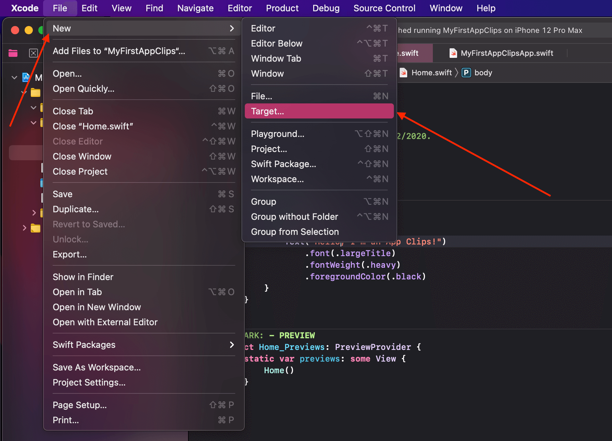

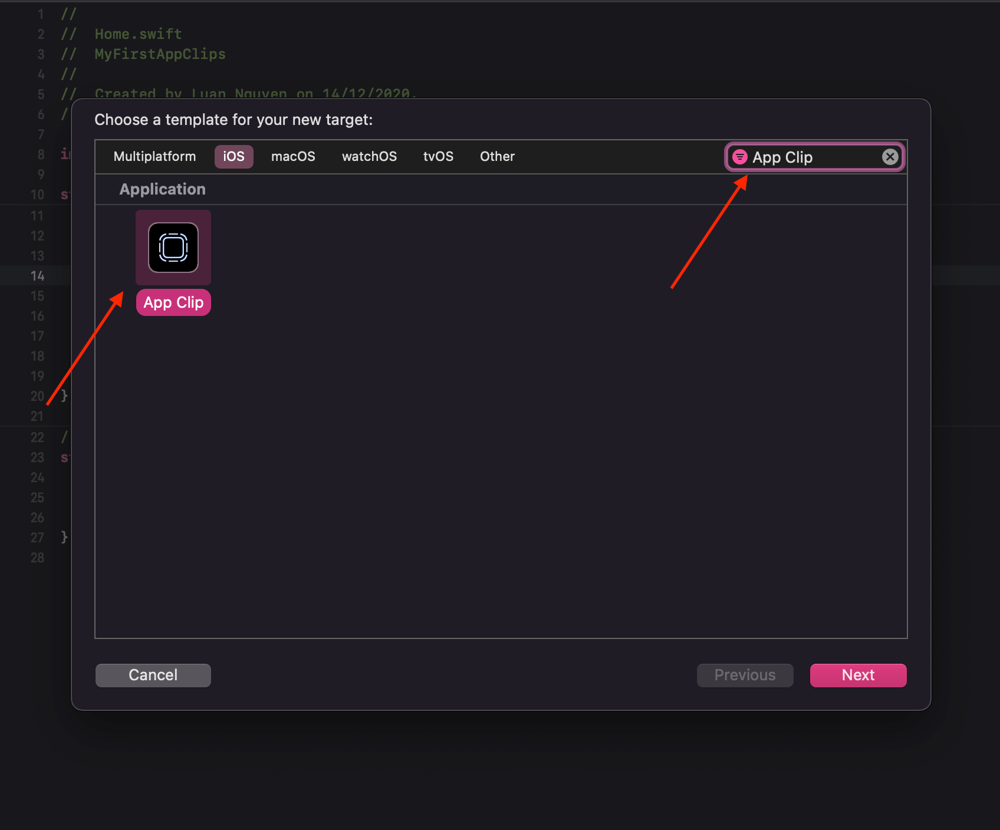

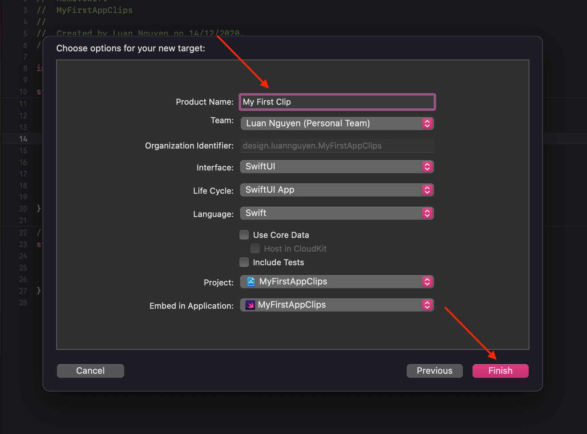

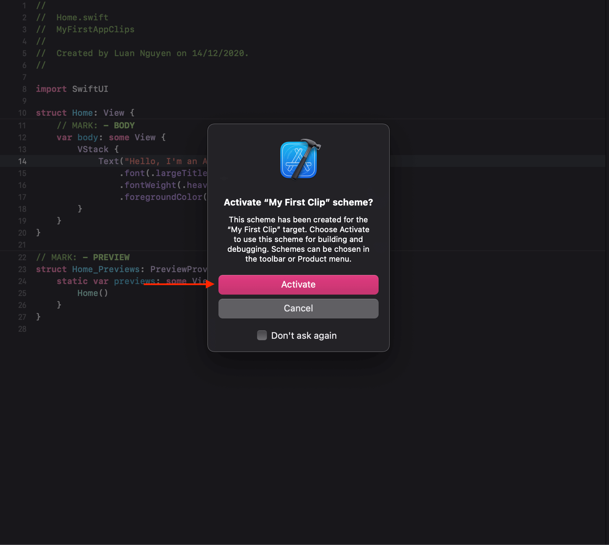

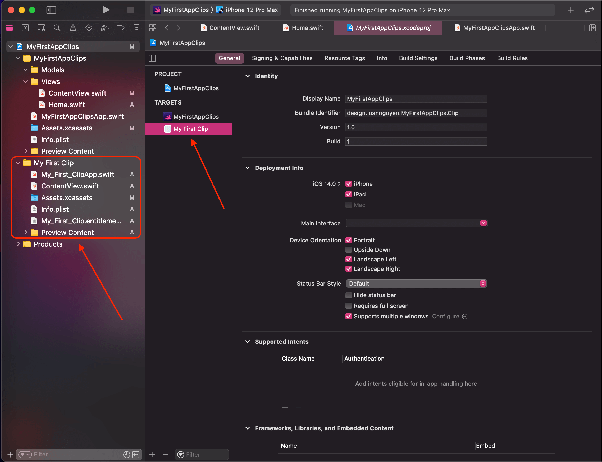

2. Setup and deploy app clip domain using Firebase hosting

- Install Firebase Tools: `sudo npm i -g firebase-tools`
- Login Firebase: `firebase login`
- Create Project Hosting: `mkdir MyFirstAppClip-Hosting`
- Go to Project Hosting: `cd MyFirstAppClip-Hosting`
- Initial Firebase: `firebase init`
- Select `Hosting: Configure Cloud Storage security rules`. Use `SPACEBAR` and `ENTER` to confirm.
- Select `Create a new project`
- Enter `unique project id`. I choose `myfirstappclip2020`
- Choose `defaults to your project ID` as unique project id above.
- Choose `public directory`
- Choose No `N` to `Configure as a single-page app`
- Choose No `N` to `Automatic builds and deploys with GitHub`
- Open `MyFirstAppClip-Hosting` project
- Copy

```
"headers": [
      {
        "source": "/.well-known/apple-app-site-association",
        "headers": [
          {
            "key": "Content-Type",
            "value": "application/json"
          }
        ]
      }
    ],
    "appAssociation": "NONE"
```

into `firebase.json`

```
{
  "hosting": {
    "public": "public",

    "headers": [
        {
            "source": "/.well-known/apple-app-site-association",
            "headers": [
            {
                "key": "Content-Type",
                "value": "application/json"
            }
            ]
        }
        ],
        "appAssociation": "NONE",

    "ignore": [
      "firebase.json",
      "**/.*",
      "**/node_modules/**"
    ]
  }
}
```

- Create folder `.well-known` inside `MyFirstAppClip-Hosting` project

- Go to folder `.well-known` and create `apple-app-site-association` file

- Copy `Bundle Indentifier` to `apple-app-site-association` file

[App Clips Associated Domains Issues](https://developer.apple.com/forums/thread/658974)

> "An app identifier for the App Clip, using the full app’s app identifier as its prefix, followed by a string. For example, if your full app’s app identifier is $(AppIdentifierPrefix)com.example.MyApp, the App Clip’s app identifier would be $(AppIdentifierPrefix)com.example.MyApp.Clip."

```
{
    "appclips": {
        "apps": [
            "12345ALF.<Bundle Indentifier>"
        ]
    }
}
```

like this:

```
{
    "appclips": {
        "apps": [
            "12345ALF.design.luannguyen.MyFirstAppClips.Clip"
        ]
    }
}
```

Test: `"12345ALF.com.alfianlosari.MovieDb.Clip"`

```
{
	"appclips": {
		"apps": ["<TEAM_ID>.<APPCLIP_BUNDLE_ID>"]
	}
}
```

TEAM_ID: [Locating your Apple Team ID](https://support.customchurchapps.com/hc/en-us/articles/360038612853-Locating-your-Apple-Team-ID)
APPCLIP_BUNDLE_ID: General > Bundle Indentifier

- Deploy project .well-known: `firebase deploy`

We have:

Project Console: `https://console.firebase.google.com/project/myfirstappclip2020/overview`
Hosting URL: `https://myfirstappclip2020.web.app`

- Open `https://myfirstappclip2020.web.app/.well-known/apple-app-site-association`

3. Update the App Clip target associated domain
4. Add App Clip Target Membership to the shared Swift source files
5. Configure the App Clip Views
6. Handle the Deeplink URL with Project ID param
7. Testing the App Clip locally with Xcode simulator
8. Testing the App Card using Local Experience NFC tag invocation

---

## Setting up Associated Domains

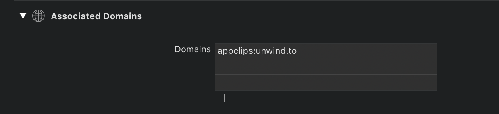

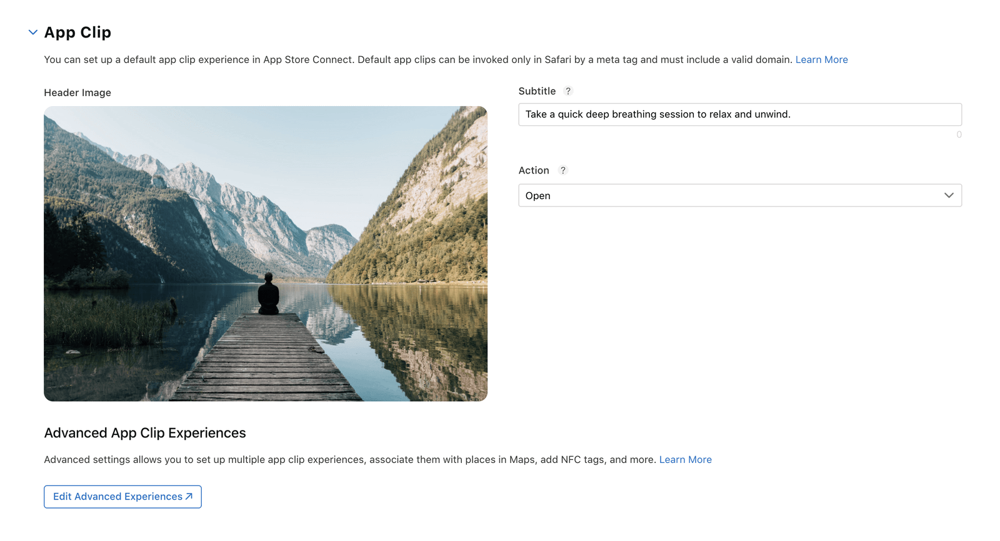

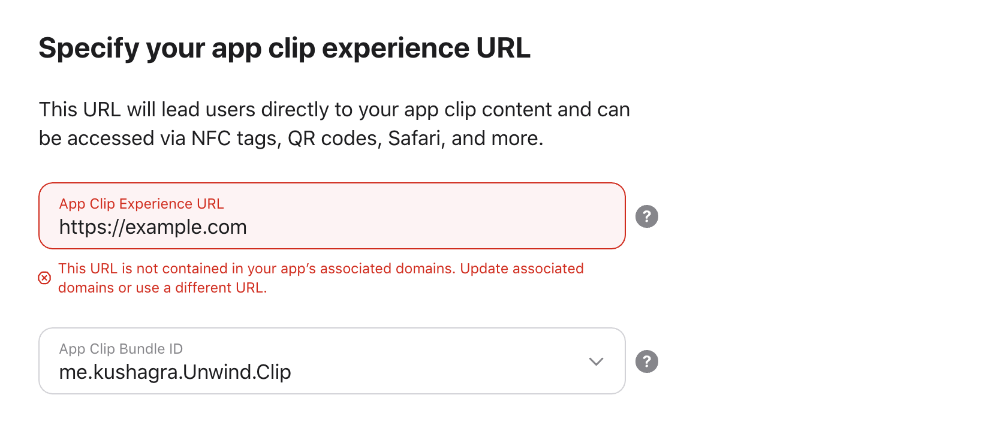

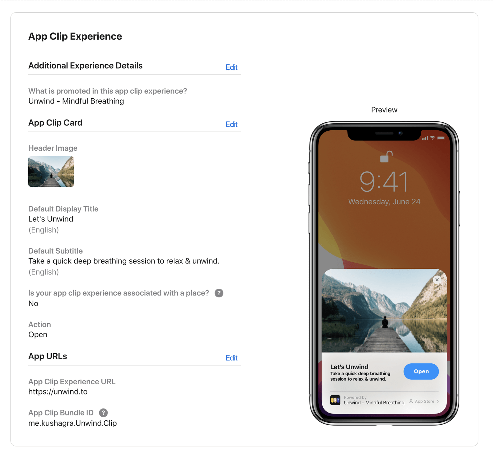


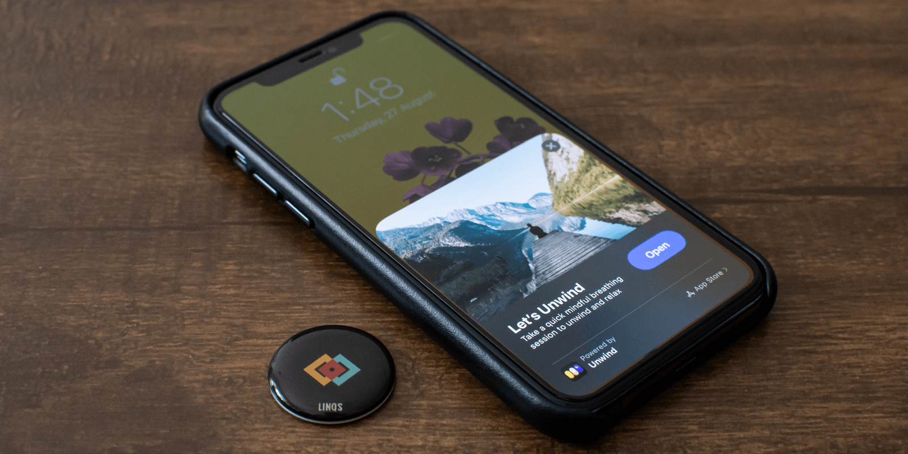

[How to register Associated Domains with Xcode 11?](https://stackoverflow.com/questions/58223540/how-to-register-associated-domains-with-xcode-11)

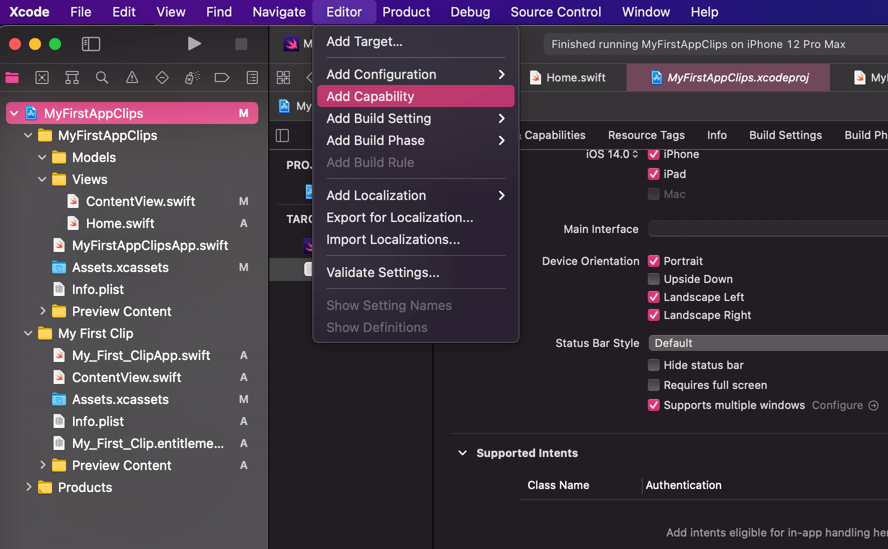

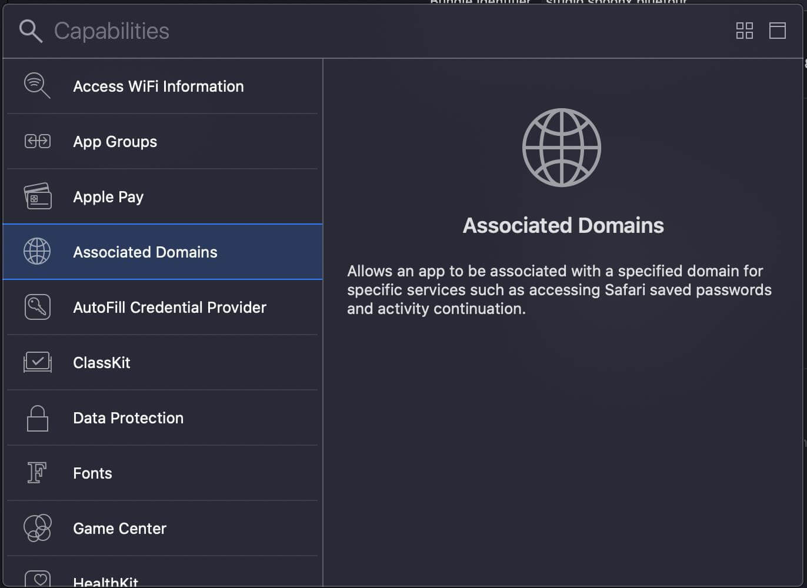

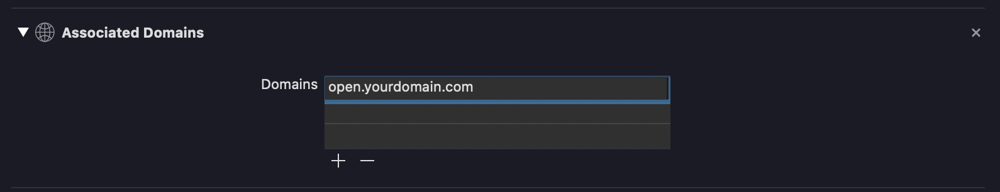

- Turn off Automically manage signing to visible Capabilities

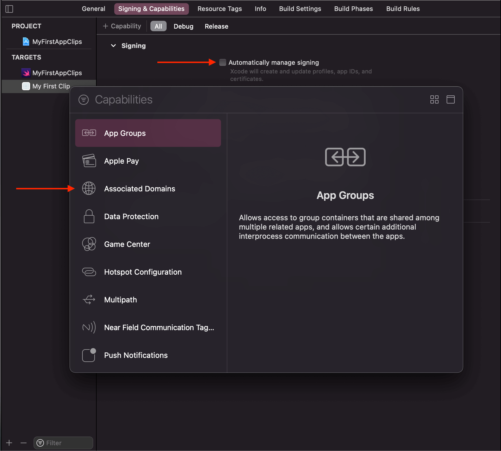

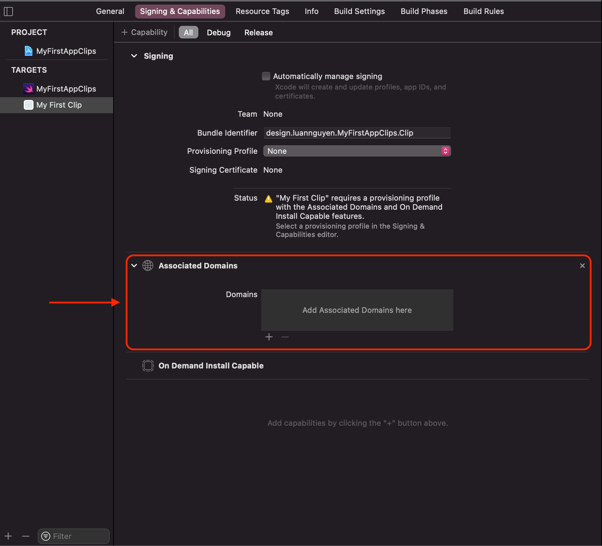


---

## App Clip Demo

[App Clip Demo](https://vimeo.com/470989935)

---

## Building App Clips Target in iOS 14 by Xcoding with Alfian

[Building App Clips Target in iOS 14 | NFC Tags Invocation](https://www.youtube.com/watch?v=_hNNDRR2Ldg)

---

- [Test and Invoke App Clip Cards with NFC tags](https://kushagra.me/testing-app-clip-cards-with-nfc-tags/)

- [Test an App Clip experience](https://help.apple.com/app-store-connect/#/devbc57e2ec6)

---

- [How to Create App Clips](https://exyte.com/blog/how-to-create-app-clips)

---

- [App Clips - App Clips - Human Interface Guidelines - Apple Developer](https://developer.apple.com/design/human-interface-guidelines/app-clips/overview/)

- [Introducing App Clips](https://developer.apple.com/app-clips/)

- [App Clips](https://developer.apple.com/documentation/app_clips)

- [Creating an App Clip with Xcode](https://developer.apple.com/documentation/app_clips/creating_an_app_clip_with_xcode)

- [Fruta: Building a Feature-Rich App with SwiftUI](https://developer.apple.com/documentation/app_clips/fruta_building_a_feature-rich_app_with_swiftui)
