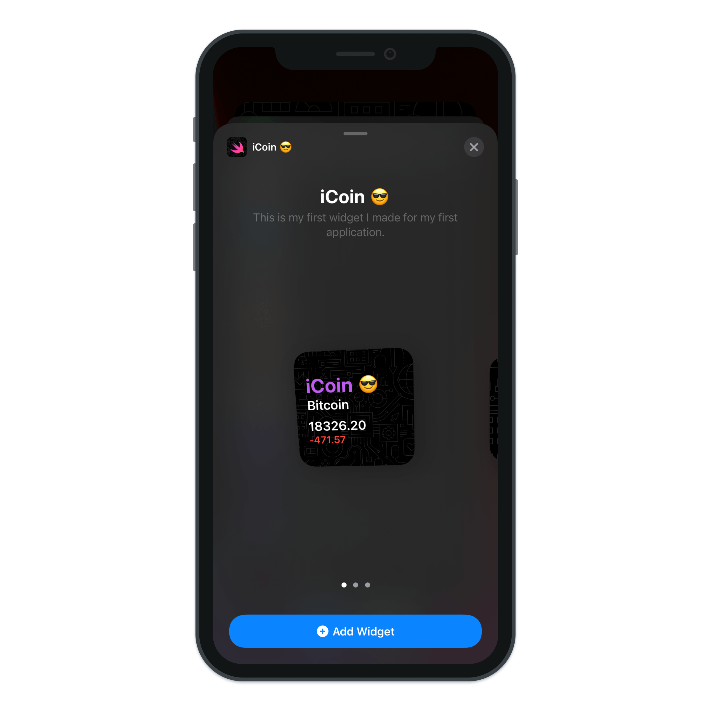
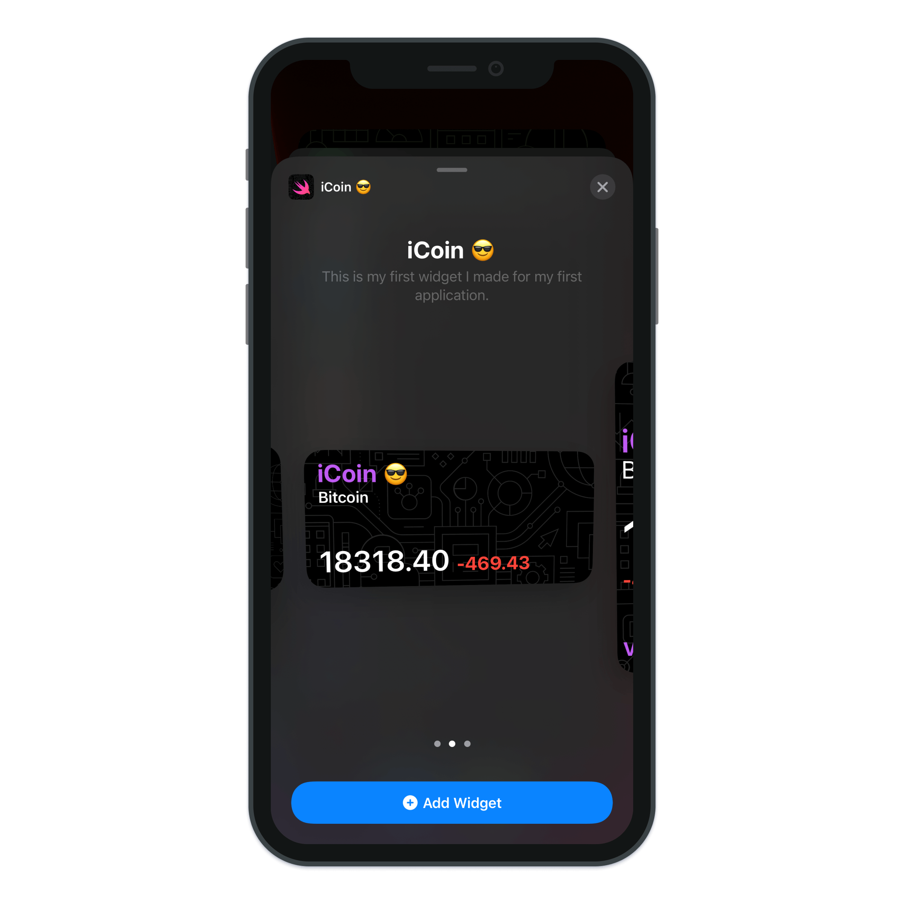
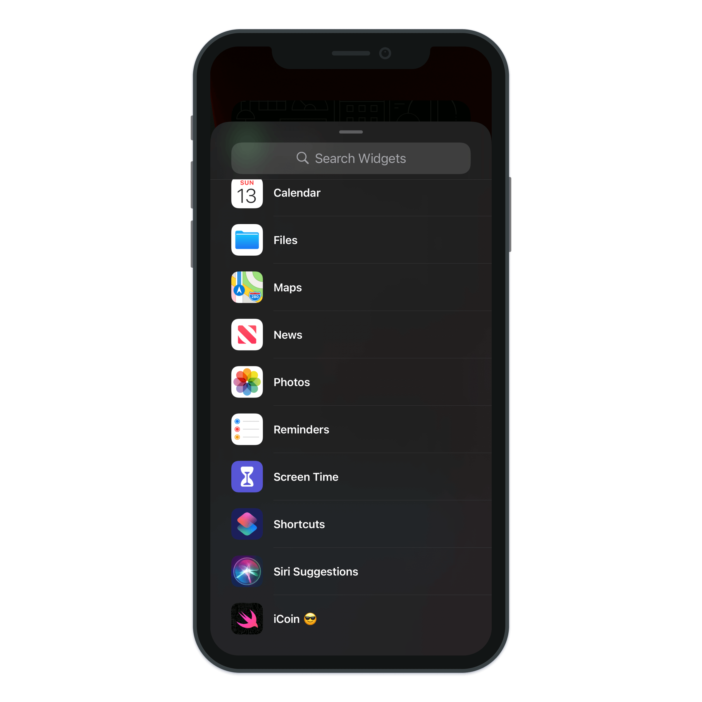
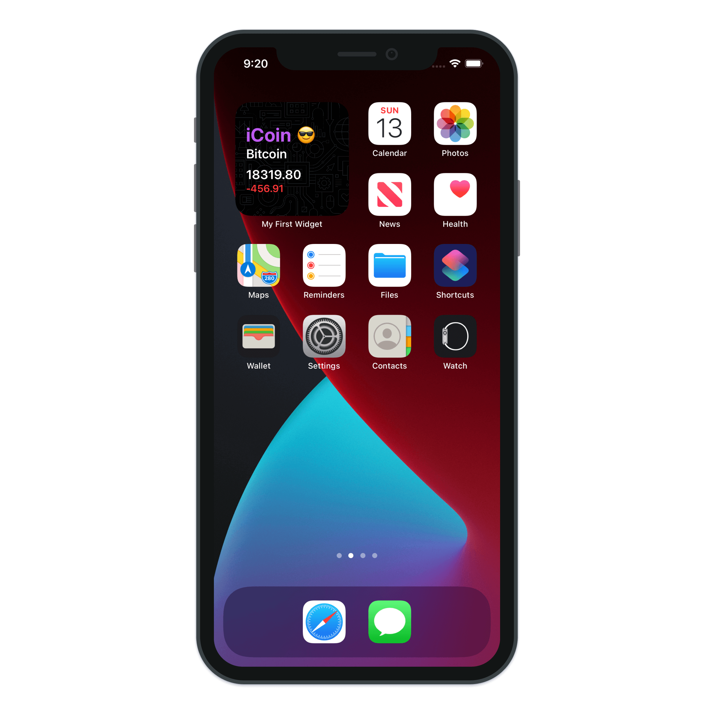
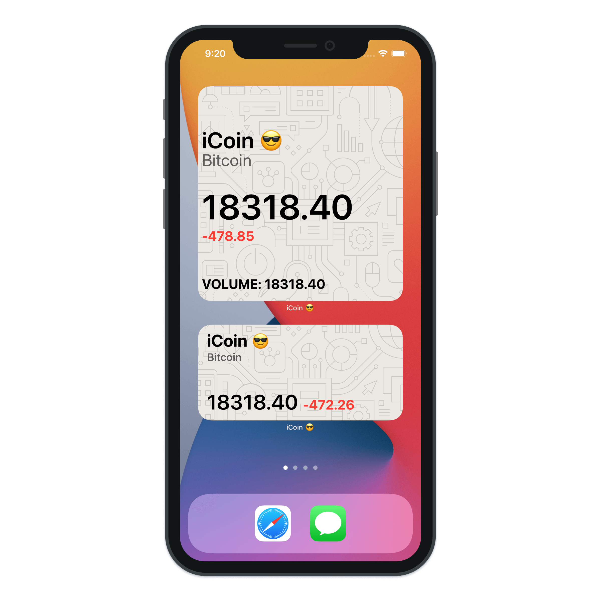
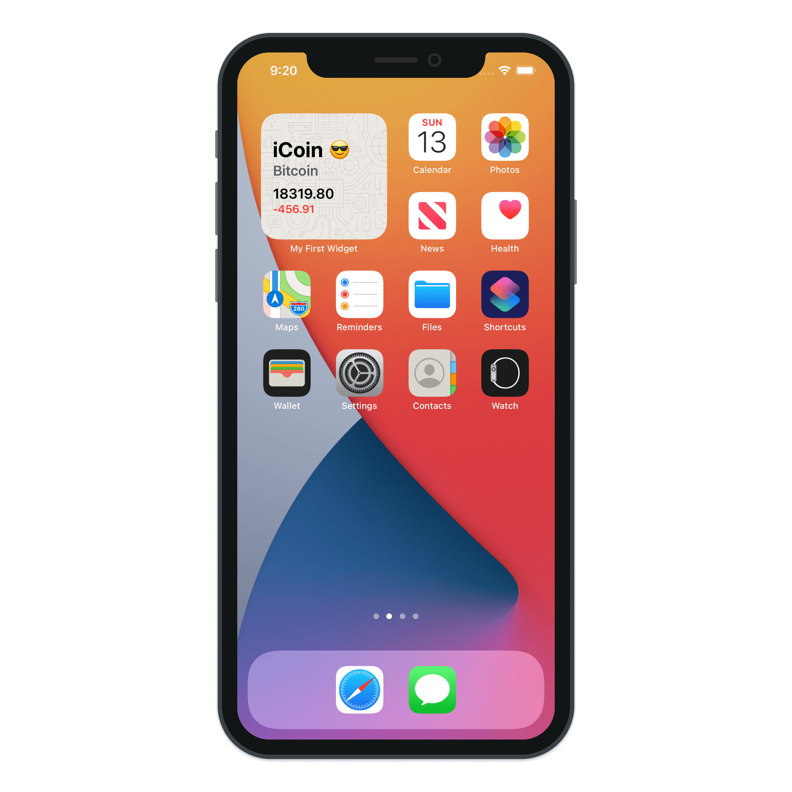
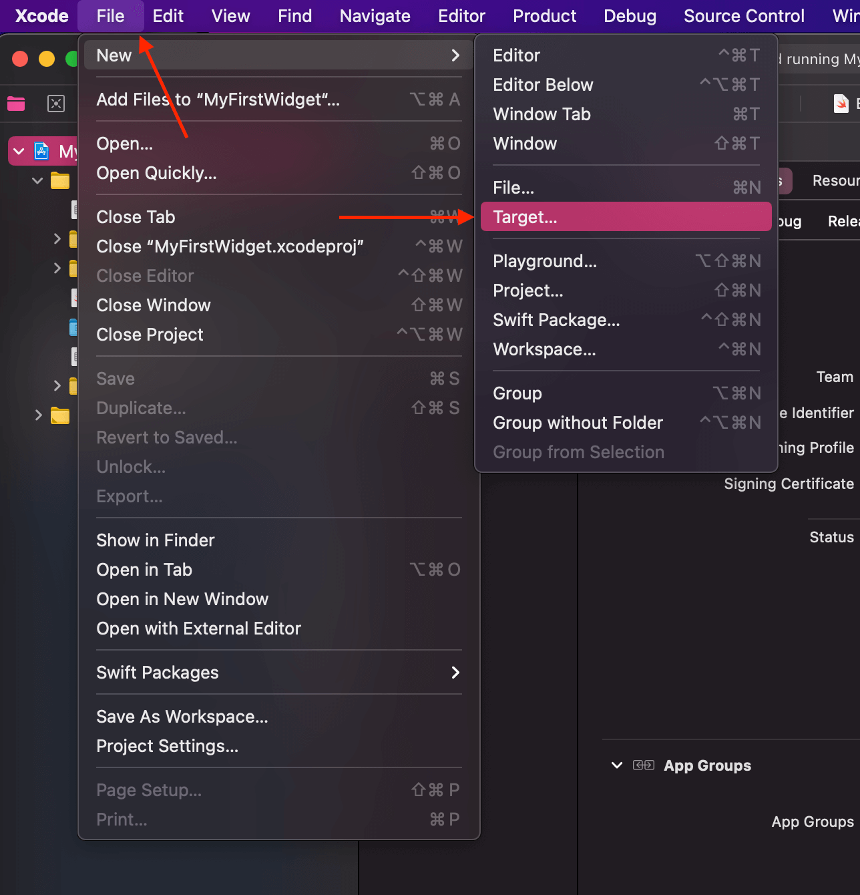
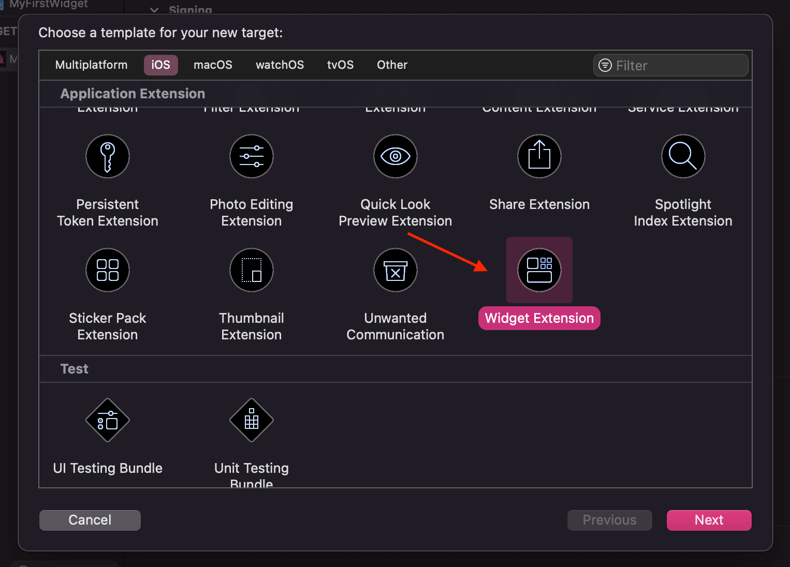
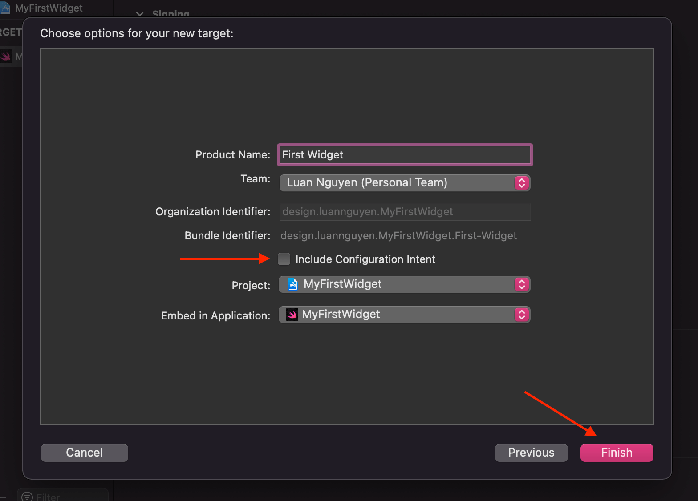
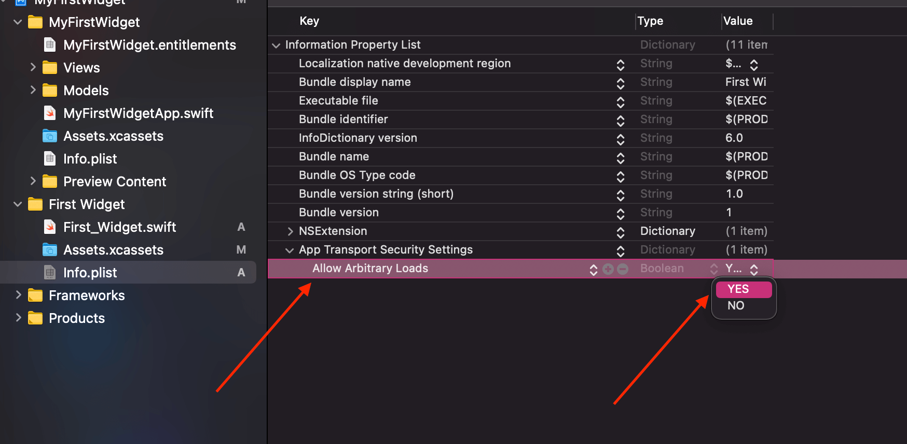

# My First Widget

> Build a simple Widget for iOS with SwiftUI.

---

---

---

- Designing for Widget for iOS 14
- Design Widget iOS 14
- Setup Widget Extension
- SwiftUI Widget
- SwiftUI Extension
- Xcode 12 Swift 2.0

---

- [Design great widgets](https://developer.apple.com/videos/play/wwdc2020/10103/)

- [Make an iOS widget with SwiftUI - Part 1](https://www.youtube.com/watch?v=151GCQlGsKg)

- [Make an iOS widget with SwiftUI - Part 2](https://www.youtube.com/watch?v=LxKyuLAxwi8)

- [Make an iOS widget with SwiftUI - Part 3](https://www.youtube.com/watch?v=kPo6bZ8wh8E)
