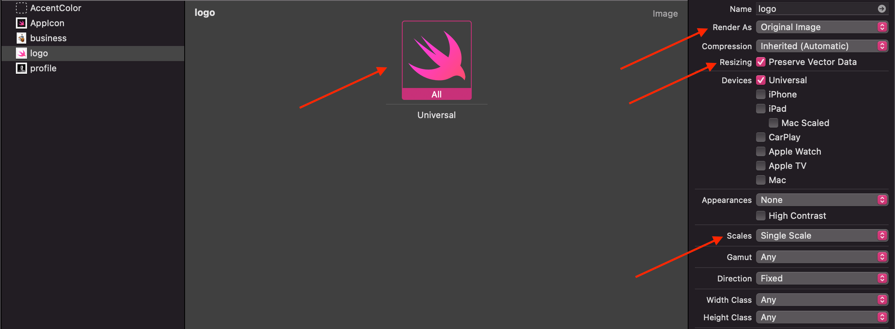
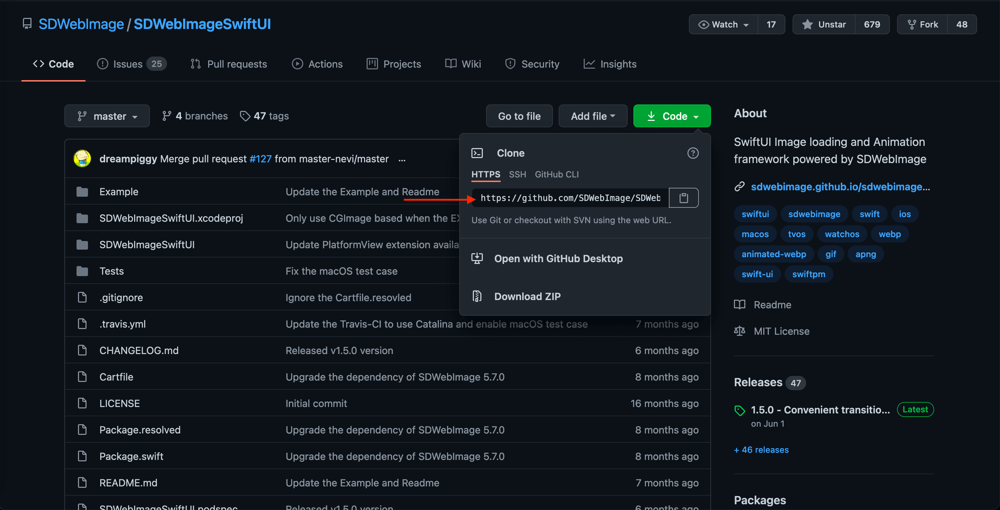
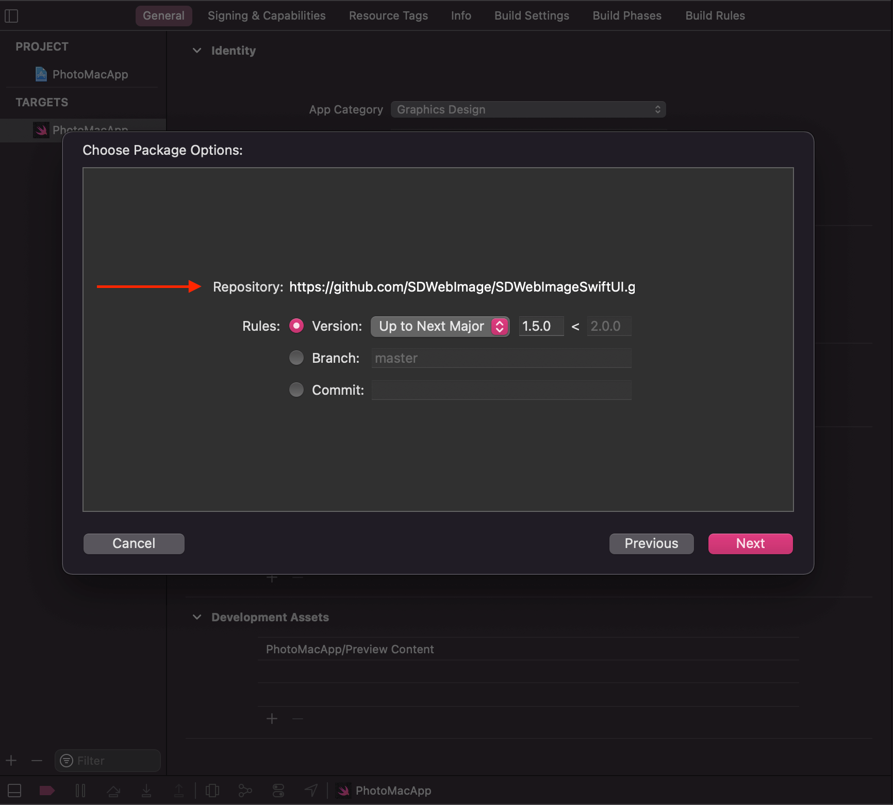
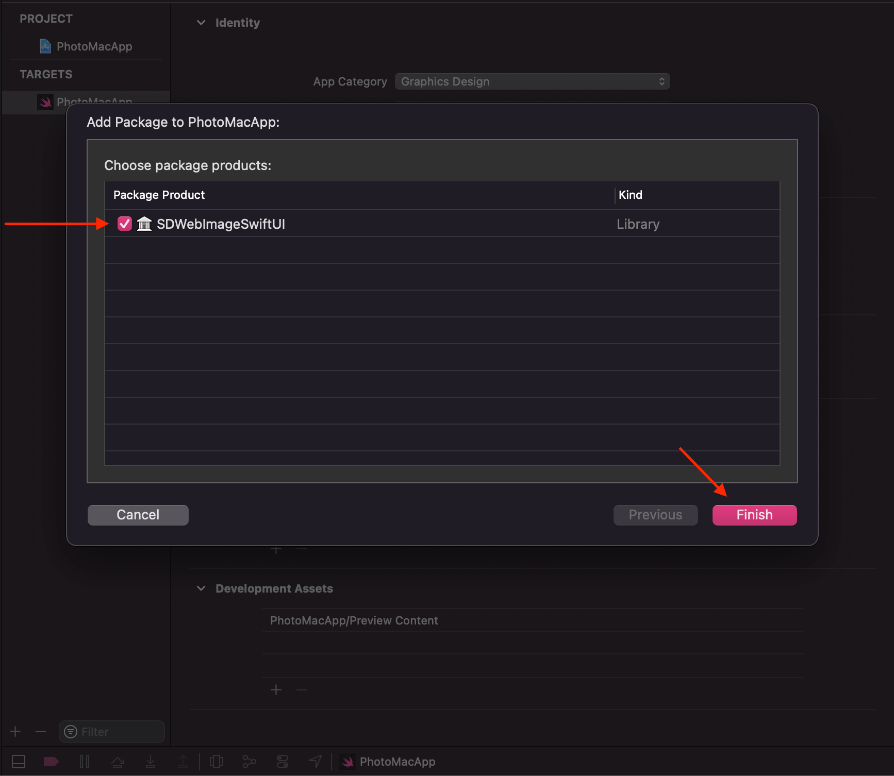
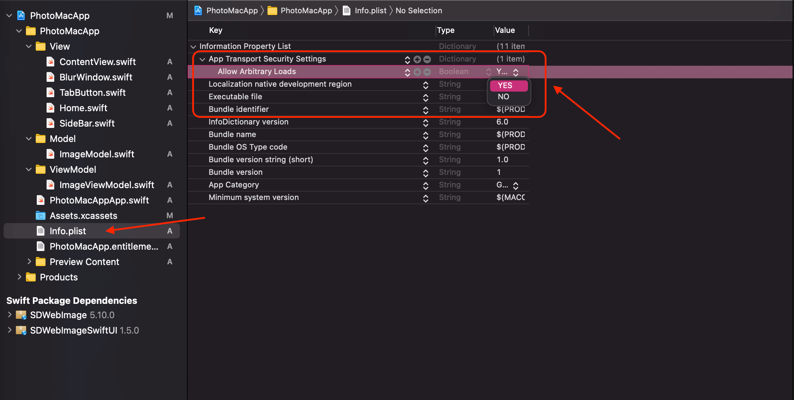

# Photo Mac App

> Build a Photo Mac application with SwiftUI.

---

## Use SVG File in iOS

---

## Add SDWebImageSwiftUI Framework

---

## Allow Incoming Connections

---

## Fix Transport Security has blocked a cleartext HTTP

Transport Security has blocked a cleartext HTTP (http://) resource load since it is insecure. Temporary exceptions can be configured via your app's Info.plist file.

- Go to `Info.plist`
- Add `App Transport Security Settings`
- Set `Allow Arbitrary Loads` to `YES`

[Transport security has blocked a cleartext HTTP](https://stackoverflow.com/questions/31254725/transport-security-has-blocked-a-cleartext-http)
