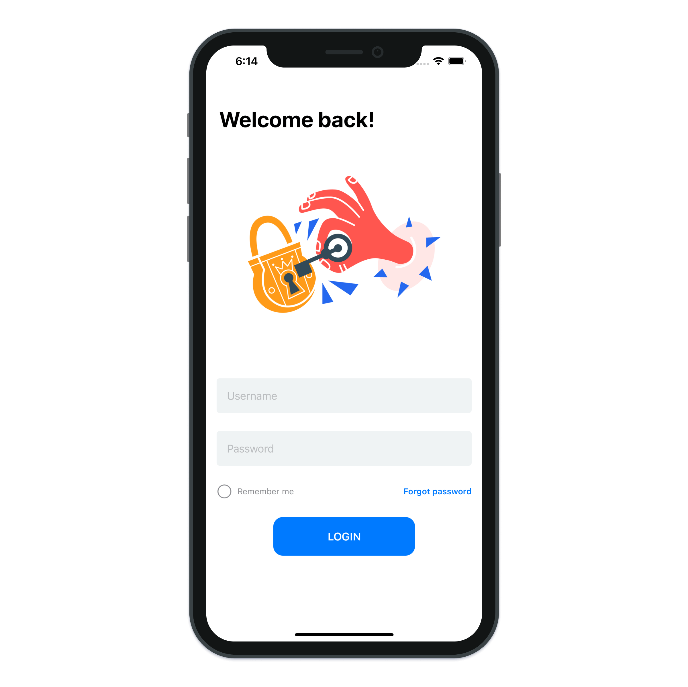

# Prevent Keyboard Hiding Views

> To deliver a good user experience, you have to make sure that the user can see what he is typing. Therefore, it’s crucial to prevent the toggled keyboard from hiding your view’s content.

---

[How to prevent the keyboard from hiding your SwiftUI view](https://blckbirds.com/post/prevent-the-keyboard-from-hiding-swiftui-view/)
