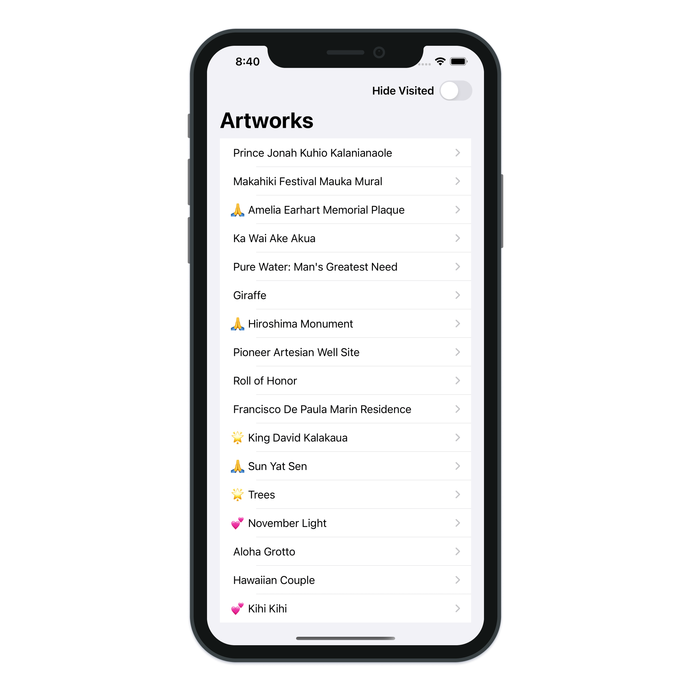
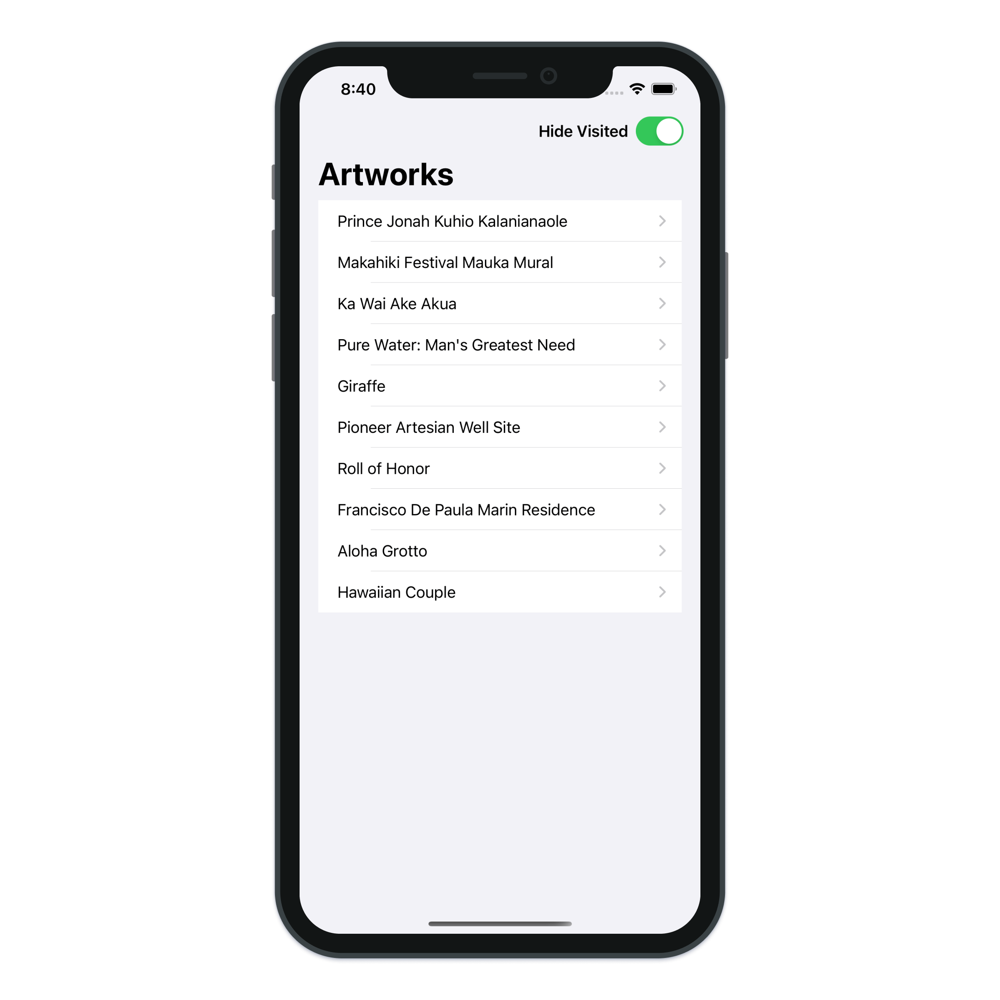
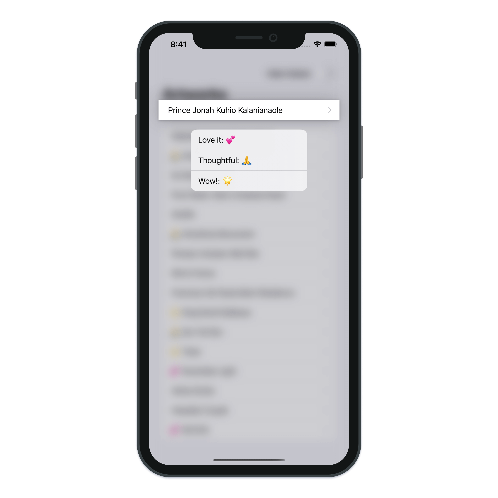
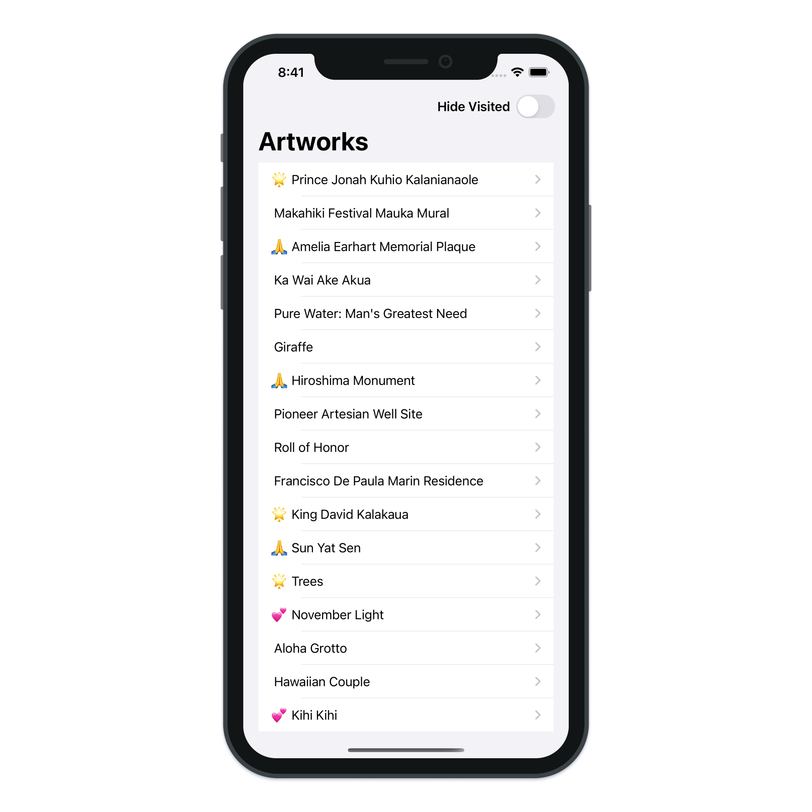
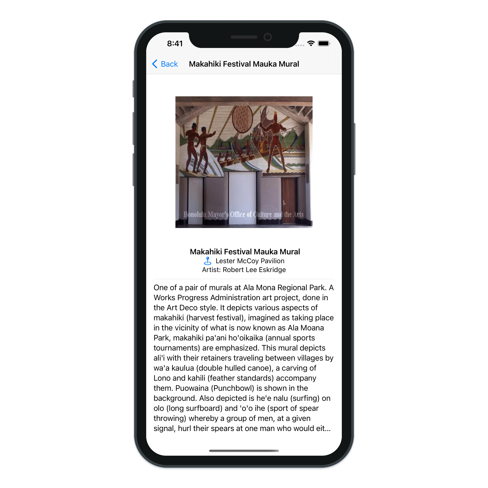
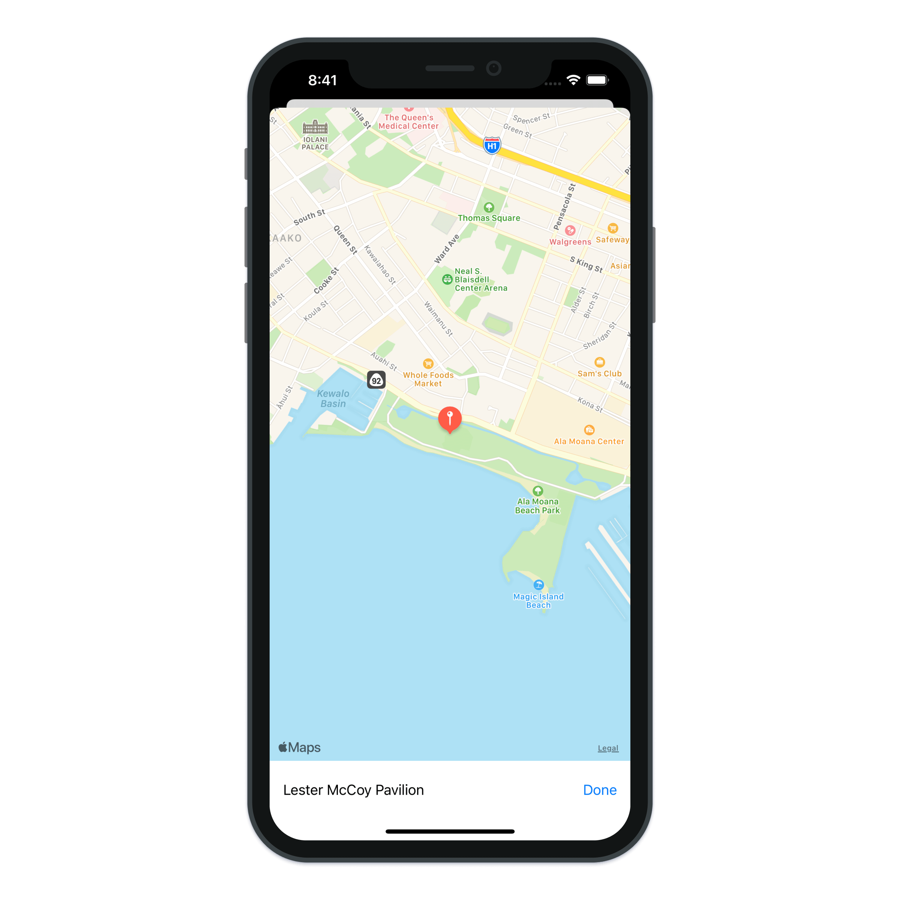

# Public Art

> Build a Public Art application with SwiftUI.

---

- SwiftUI MapKit
- SwiftUI VStack
- SwiftUI HStack
- SwiftUI TextView
- SwiftUI Spacer
- SwiftUI Button
- SwiftUI Image
- SwiftUI Sheet
- SwiftUI Divider
- SwiftUI NavigationView
- SwiftUI NavigationBar
- SwiftUI List
- SwiftUI ContextMenu
