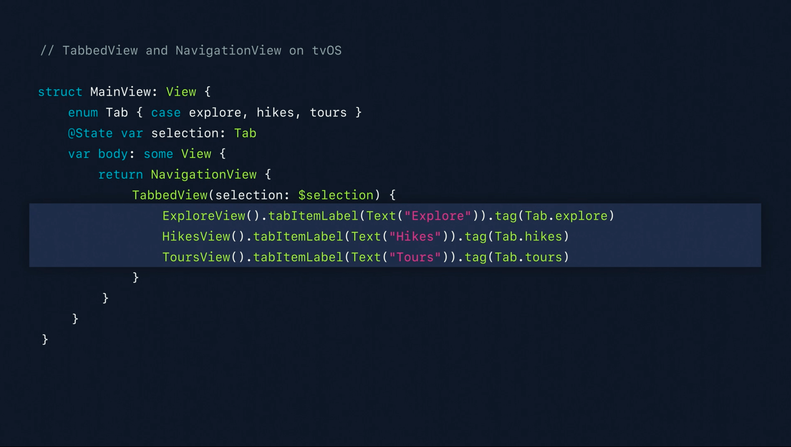

# My Swift Journey

[](https://opensource.org/licenses/MIT)


[](https://developer.apple.com/xcode/interface-builder/)


> A collection for my journey to learn Swift programming language, a powerful and intuitive programming language for macOS, iOS, watchOS, tvOS and beyond.


Visit Swift official website: [Swift](https://developer.apple.com/swift/)

Visit SwiftUI website: [SwiftUI](https://developer.apple.com/xcode/swiftui/)

---

## SwiftUI

> SwiftUI is a modern way to declare user interfaces for any Apple platform. Create beautiful, dynamic apps faster than ever before.

SwiftUI is an innovative new way to build user interfaces across all Apple platforms, so you can create better apps with less code. With a declarative Swift syntax that’s easy to read and natural to write, SwiftUI works seamlessly with new Xcode design tools to keep your code and design perfectly in sync. Automatic support for Dynamic Type, Dark Mode, localization, and accessibility means your first line of SwiftUI code is already the most powerful UI code you’ve ever written.

Visit SwiftUI Tutorials from Apple: [SwiftUI Tutorials](https://developer.apple.com/tutorials/swiftui)

---

## Detect Dark Mode

```swift
@Environment(\.colorScheme) var colorScheme

.foregroundColor(colorScheme == .dark ? Color.black : Color.white)
```

---

## Change Status Bar

```swift
import SwiftUI

// Using this to provide .lightContent status bar style
class HostingController<T: View>: UIHostingController<T> {
    override var preferredStatusBarStyle: UIStatusBarStyle {
        return .lightContent
    }
}
```

---

## Use HEX Colors

```swift
import SwiftUI

prefix operator ⋮
prefix func ⋮(hex:UInt32) -> Color {
    return Color(hex)
}

extension Color {
    init(_ hex: UInt32, opacity:Double = 1.0) {
        let red = Double((hex & 0xff0000) >> 16) / 255.0
        let green = Double((hex & 0xff00) >> 8) / 255.0
        let blue = Double((hex & 0xff) >> 0) / 255.0
        self.init(.sRGB, red: red, green: green, blue: blue, opacity: opacity)
    }
}

let hexColor:(UInt32) -> (Color) = {
    return Color($0)
}
```

Use: `.foregroundColor(Color(0x111111))`

---

# For phones having lesser screen size

`ScrollView(UIScreen.main.bounds.height < 750 ? .vertical : .init(), showsIndicators: false) { ... }`

---

- Take a design-first approach
- Effortlessly share model code
- Be judicious when sharing new code
- Learn once, apply anywhere

## iOS

---

## iPadOS

---

## macOS

- Keyboard shortcuts

---

## watchOS

1. Provide useful information
2. Offer intuitive actions
3. Deliver at the right time

## tvOS

**3 keypoints:**

1. 10-foot experience

- Large screen
- Long viewing distance
- Extended periods of use
- Multiple viewers at the same time

2. Focus and the Siri Remote

- Entire interface must support focus
- SwiftUI supports focus by default

3. Streamlined navigation

- TabbedView



---

## Pending Projects

1. [My First App Clips](./MyFirstAppClips/)

2. [Fetch Data API](./FetchDataAPI/)

3. [Detect Shake Gestures](./DetectShakeGestures/)

4. [Auto Validation](./AutoValidation/)

5. [Simple iOS and watchOS App](./SimpleIOSAndWatchOSApp/)

---

## Update User Interface

1. [Courses App](./CoursesApp/)

2. [Custom Curves and Shapes](./CustomCurvesAndShapes/)

---

## Helpful Links

1. [SwiftUI On All Devices - WWDC 2019 - Videos - Apple Developer](https://developer.apple.com/videos/play/wwdc2019/240/)

> Once you've learned the basics of SwiftUI, you've learned what you need to know to use SwiftUI anywhere. You can use the same SwiftUI skills for making an iOS app as you would for making an app on watchOS, tvOS or macOS. We'll cover the basics, and then dig into more detail about how SwiftUI can help you make changes to your app on every Apple device. Hear about design principles for each platform and learn about how much code you can share across platforms.

## License

Copyright 2020 Luan Nguyen

Licensed under the [MIT License](./LICENSE)
