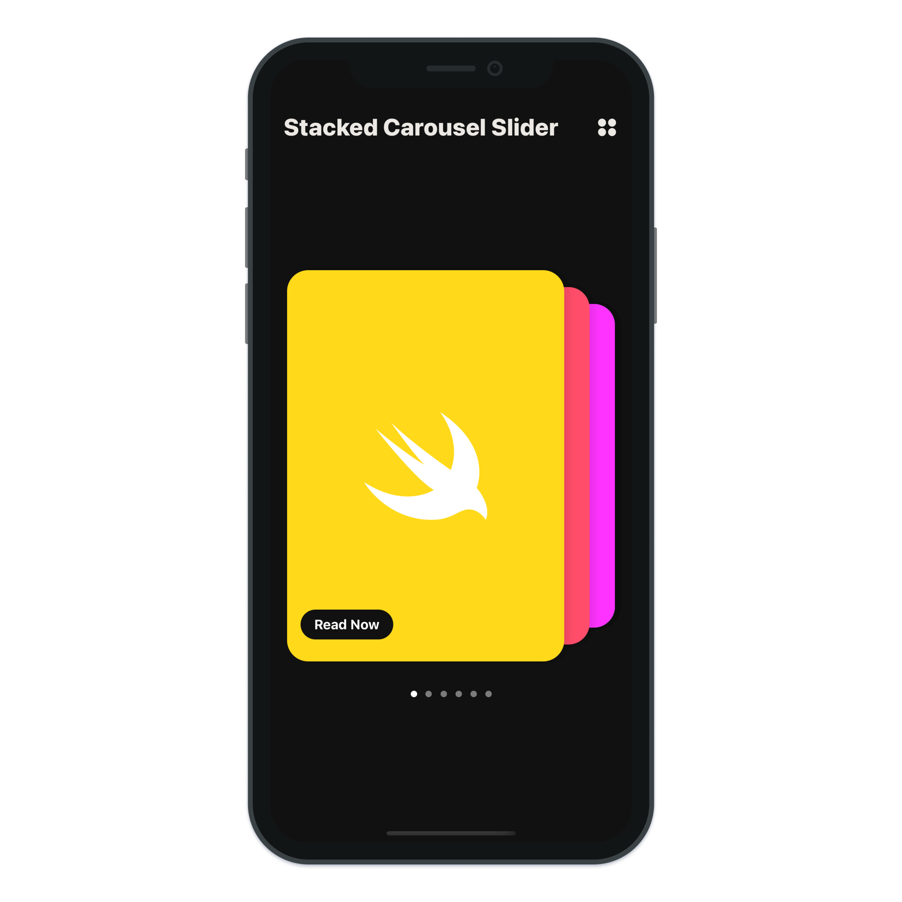
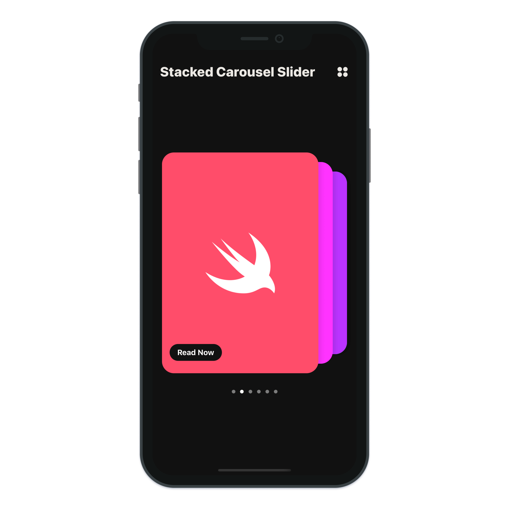
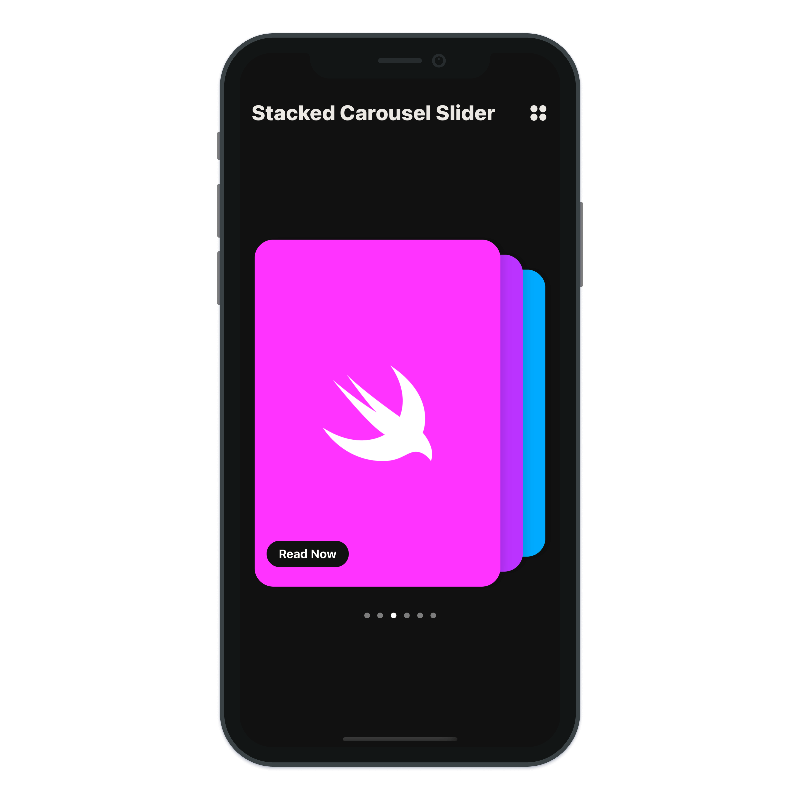
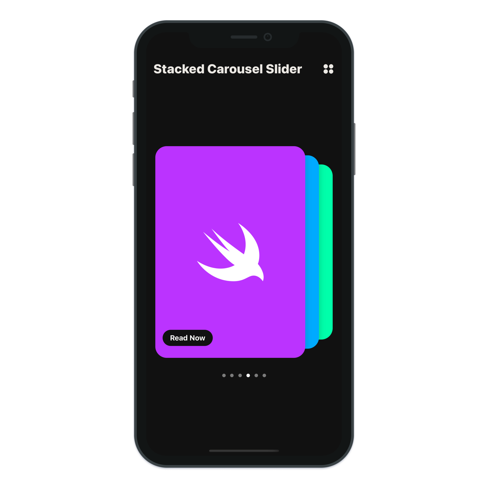
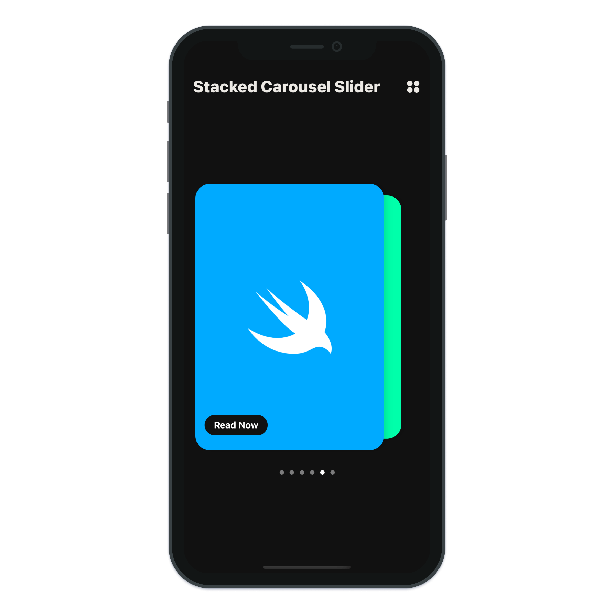
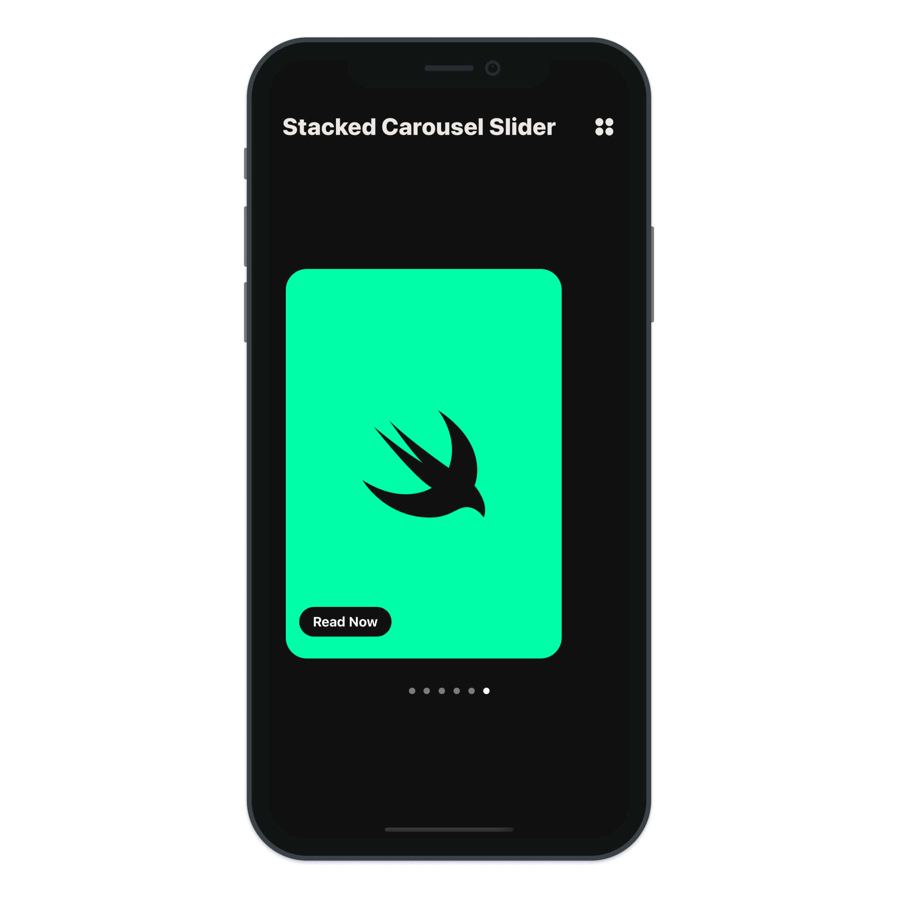

# Stacked Carousel Slider

> Build a simple carousel slider with SwiftUI Stacked Carousel Slider.

---

- SwiftUI Gesture
- SwiftUI DragGesture
- SwiftUI UIPageControl
- SwiftUI VStack
- SwiftUI HStack
- SwiftUI ZStack
- SwiftUI Spacer
- SwiftUI Button
- SwiftUI TextView
- SwiftUI Shape
- Xcode 12 SwiftUI 2.0
