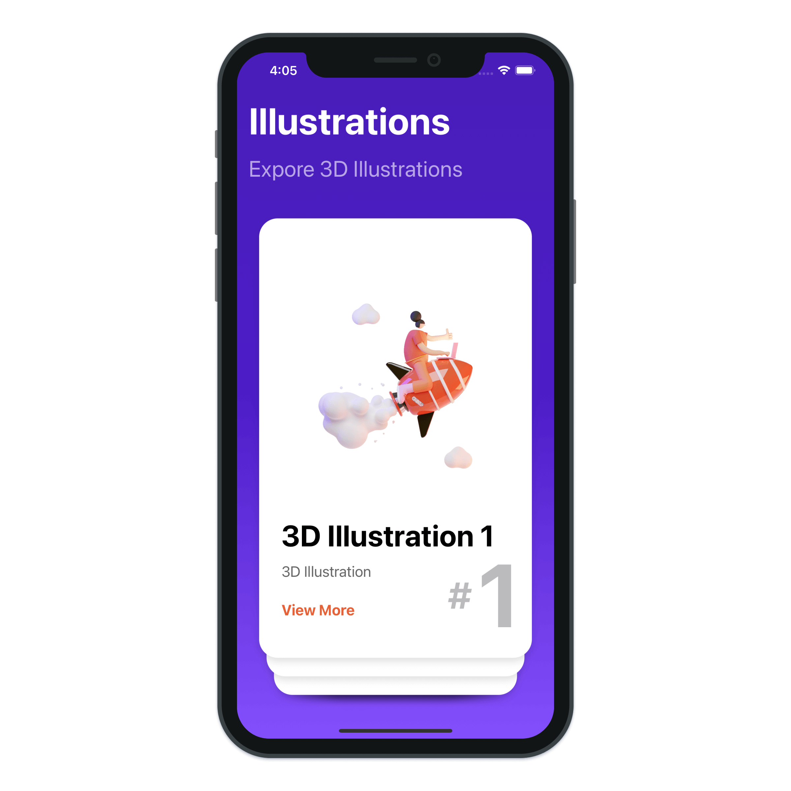
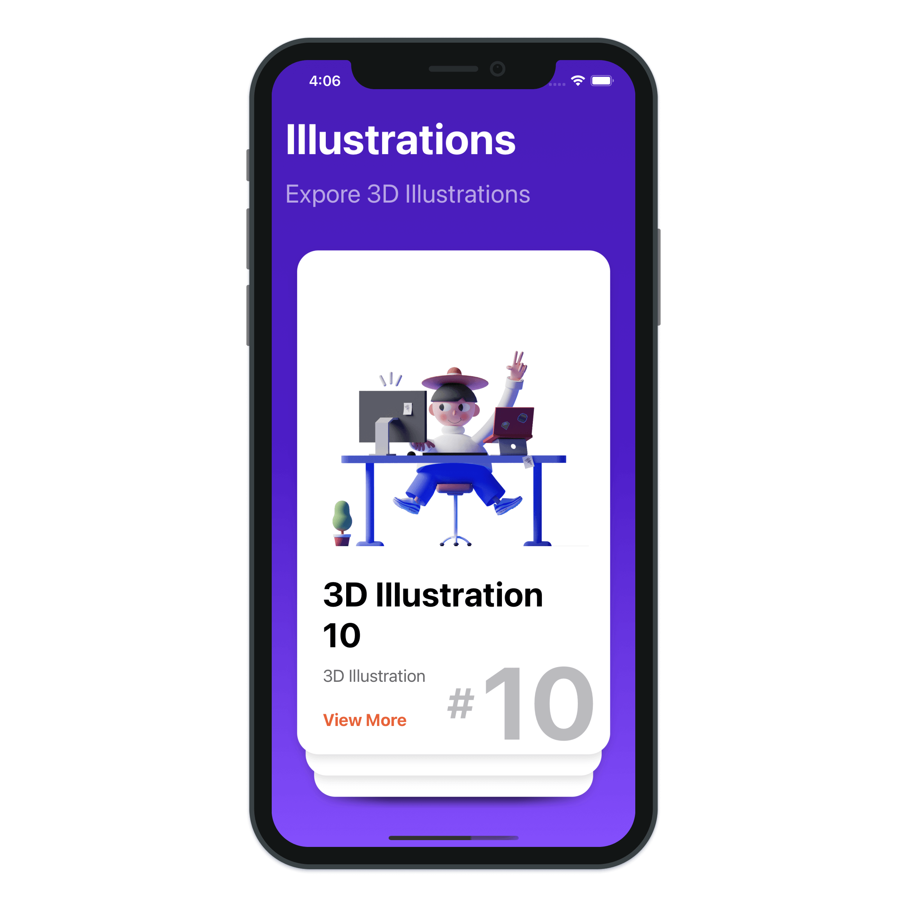
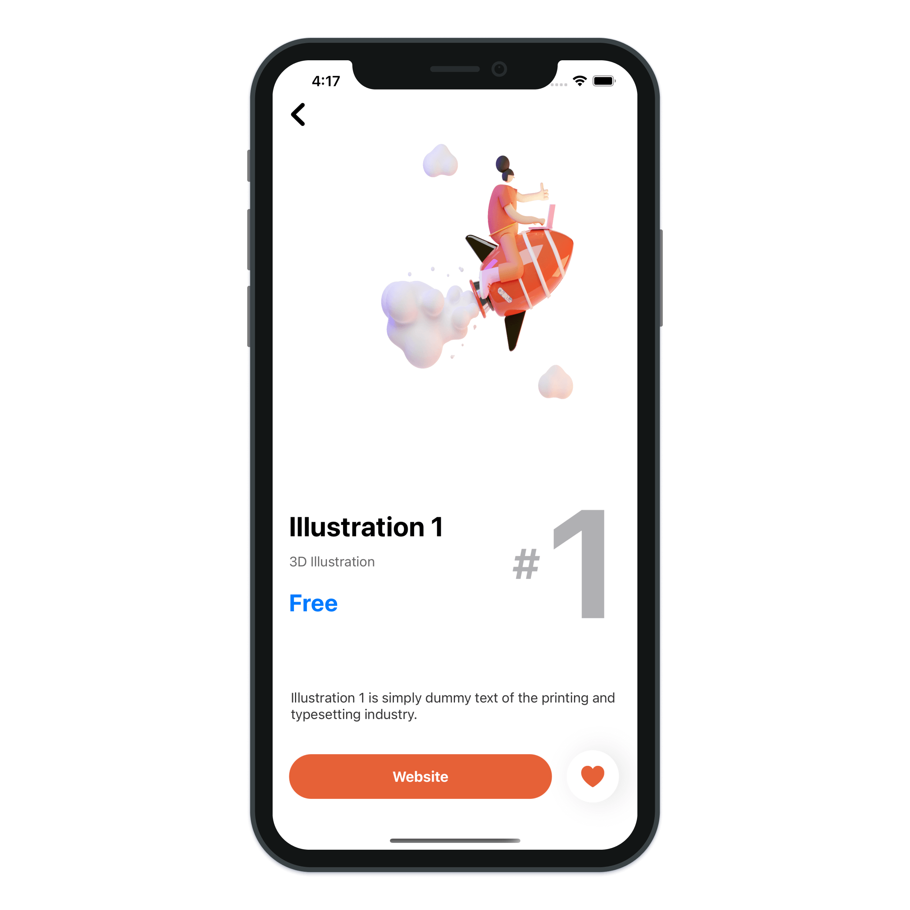

# Stacking Elements

> Build a Stacking Elements with SwiftUI.

---

- SwiftUI Swipe Gestures
- SwiftUI Geometry Reader
- SiwftUI Stacked Elements
- SwiftUI Matched Geometry Effect
- SwiftUI Card Swipe Gestures
- SwiftUI VStack
- SwiftUI HStack
- SwiftUI ZStack
- SwiftUI inear Gradient
- SwiftUI Background
- SwiftUI Animations
- SwiftUI TextView
- SwiftUI Button
- SwiftUI Spacer
- SwiftUI Shape
- SwiftUI Image
- Xcode 12 SwiftUI 2.0
