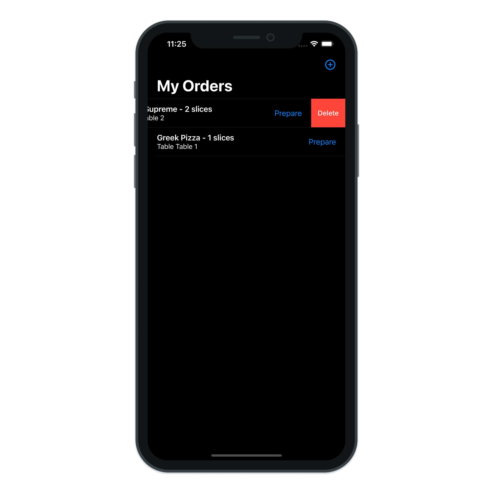
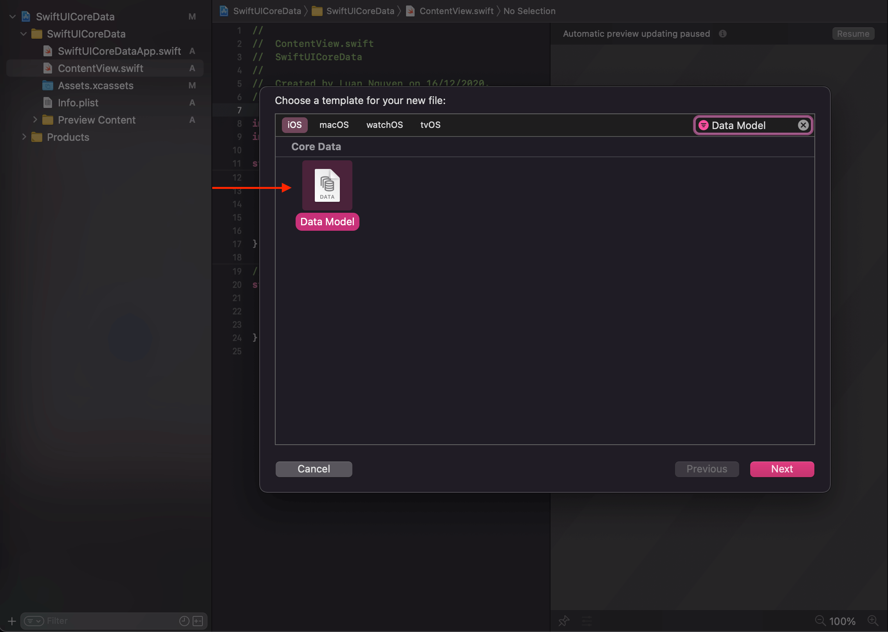
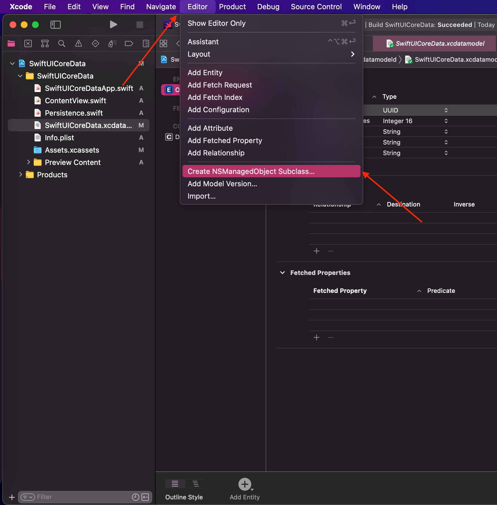

# SwiftUI Core Data

> Learn how to use the Core Data framework with SwiftUI to store and manage persistent data.

---

- How Core Data and SwiftUI work together
- Creating and updating Core Data objects
- How to update views when stored data gets updated
- Using SwiftUI property wrappers for fetching Core Data objects

---

**Create Core Data:**

**Core Data Customizing Our Data Model:**

**Core Data Codegen Manual None:**

---

[Core Data and SwiftUI 2.0 – Saving, retrieving, updating and deleting persistent data](https://blckbirds.com/post/core-data-and-swiftui/)
