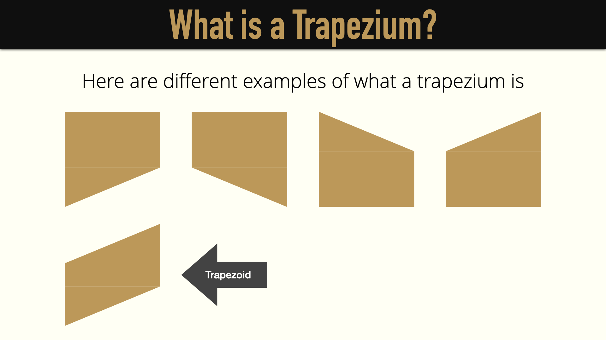
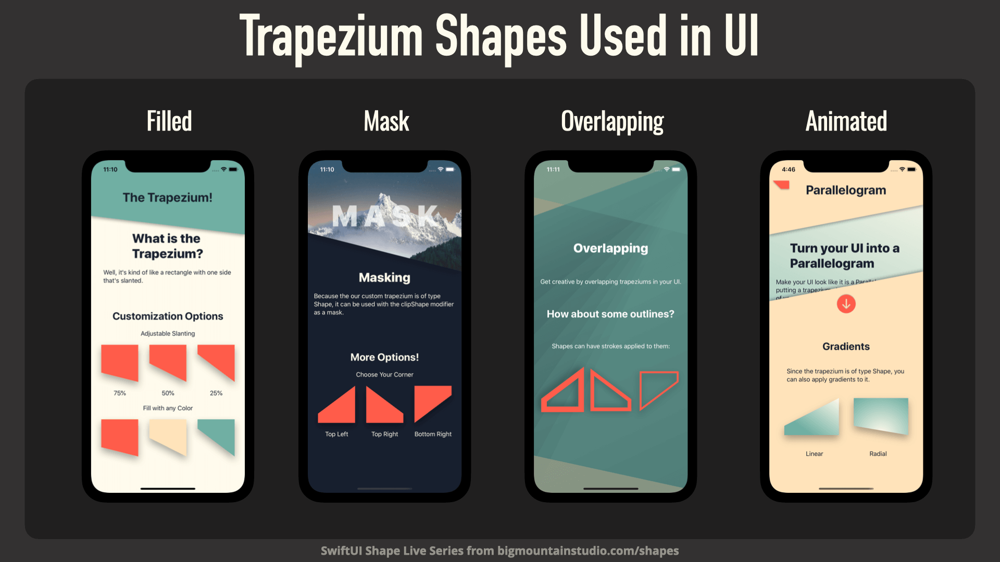
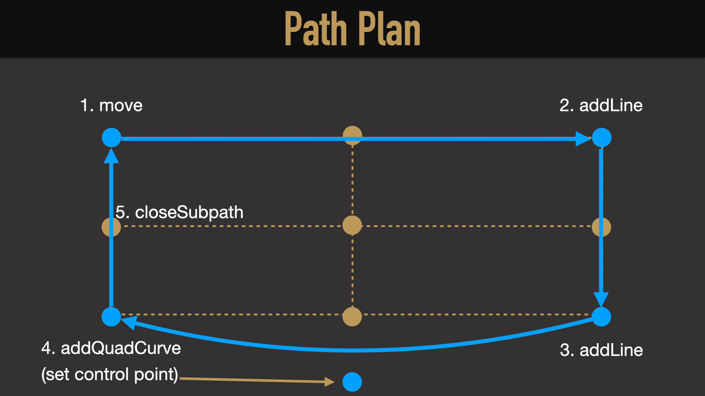
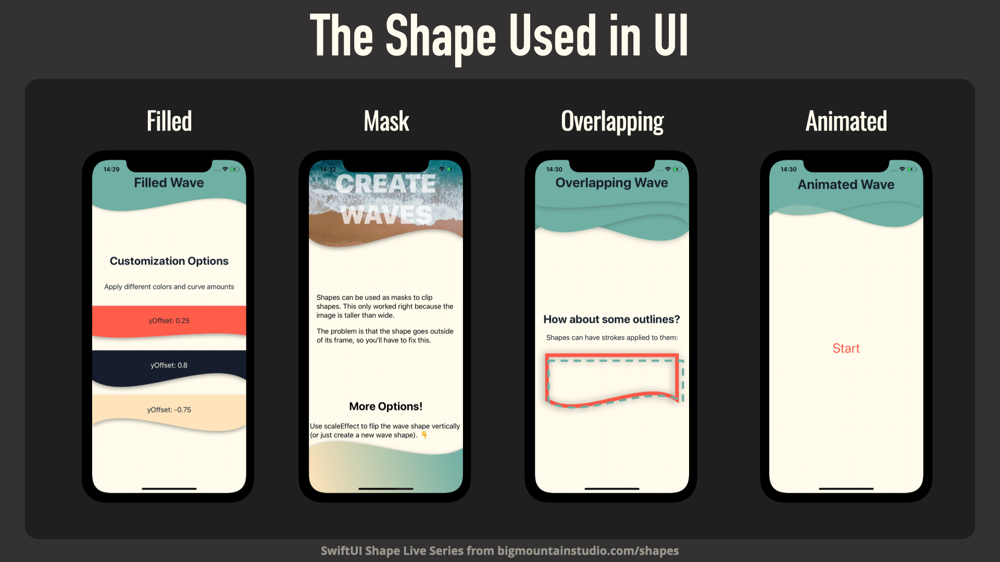
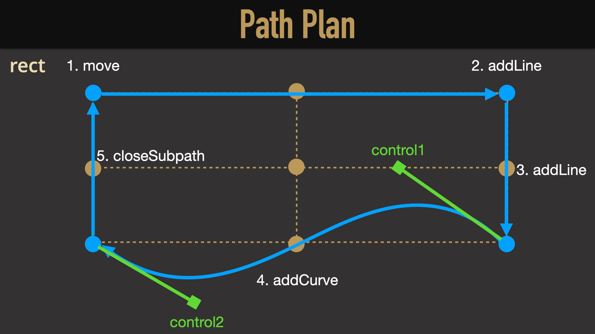
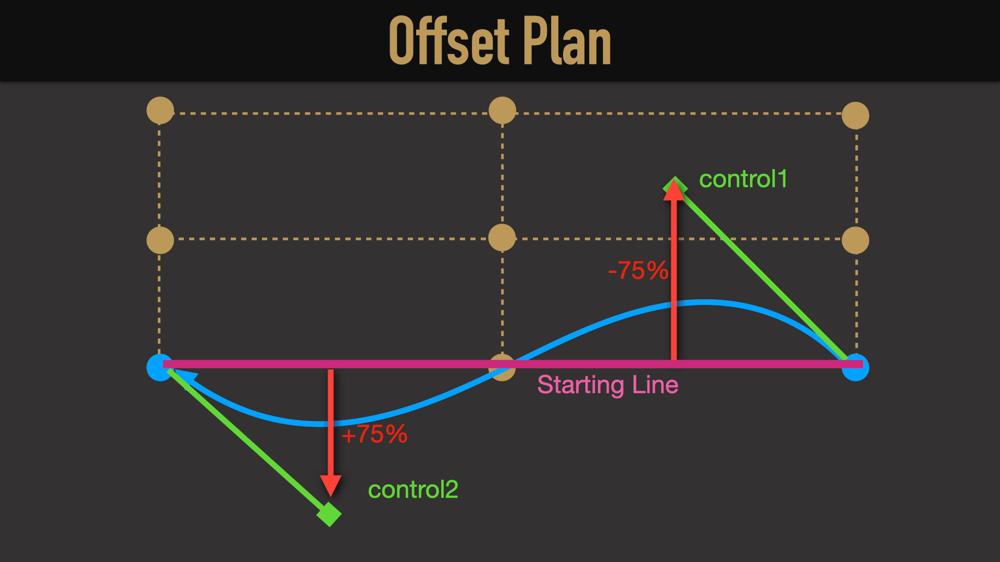
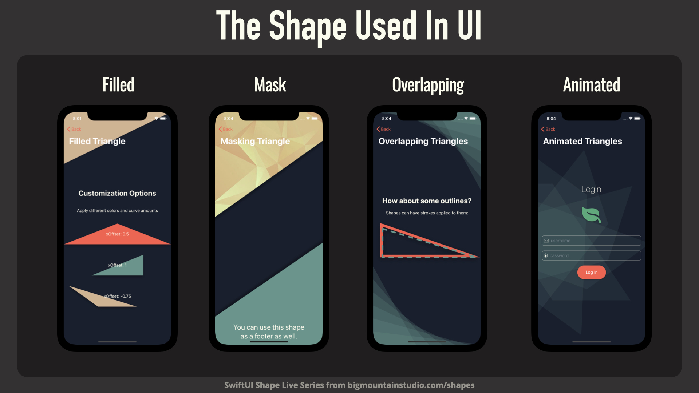
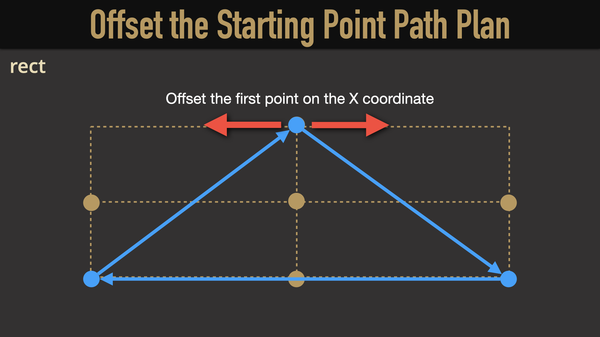

# SwiftUI Shapes

[ The SwiftUI Shapes Live Series by Mark Moeykens ](https://www.bigmountainstudio.com/courses/shapes)

---

**Using the Path Object to Draw Shapes:**

The Path object is your primary tool for drawing two-dimensional shapes. It contains all of the methods for drawing lines and curves.

**Your Path Canvas:**

When creating a shape, you are given a rectangle to draw within `(CGRect)`. You can easily reference points within this rectangle when specifying points.

**Benefits Of Shapes**

You `could` use the Path object to draw a shape directly into your view. But you will lose out on a lot of the benefits that conforming to the Shape protocol has to offer.

---

## The Trapezium Shape

[SwiftUI Shapes Live: 1 - The Trapezium](https://www.youtube.com/watch?v=d0Lc5ImoWDQ)

---

## The Curved-Side Rectangle

[SwiftUI Shapes Live: 2 - Creating a Curve-Sided Rectangle to Enhance UI](https://www.youtube.com/watch?v=7_vScyZP6EM)

> Quad curves allow you to just set one point (the control point) to create a curve with.

> We had to offset some points in our shape so we can keep the whole shape within the frame. This is useful if you want to use the shape for masking (clipShape).

---

## The Wave Shape

[SwiftUI Shapes Live: 3 - The Wave](https://www.youtube.com/watch?v=3ZHxF5Kwcqk)

> We want to customize the control handles (just on the Y-axis for now).

> I wanted a way to supply just ONE number and offset the Y coordinate of each control handles in opposite directions.

---

## The Triangular Shape

[SwiftUI Shapes Live: 4 - The Triangle Shape](https://www.youtube.com/watch?v=Bbvoh2mR_mQ)

