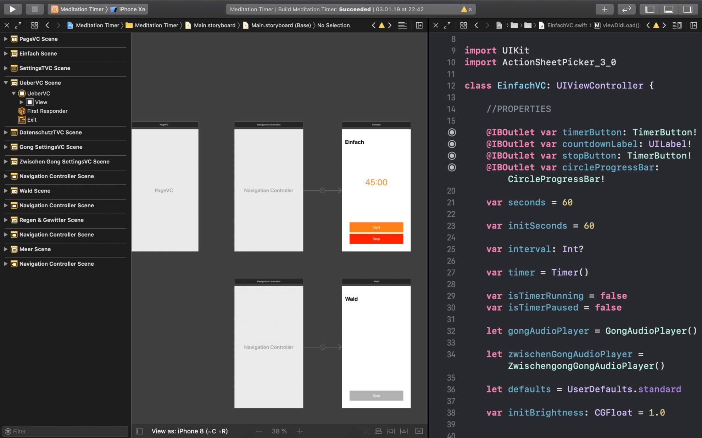
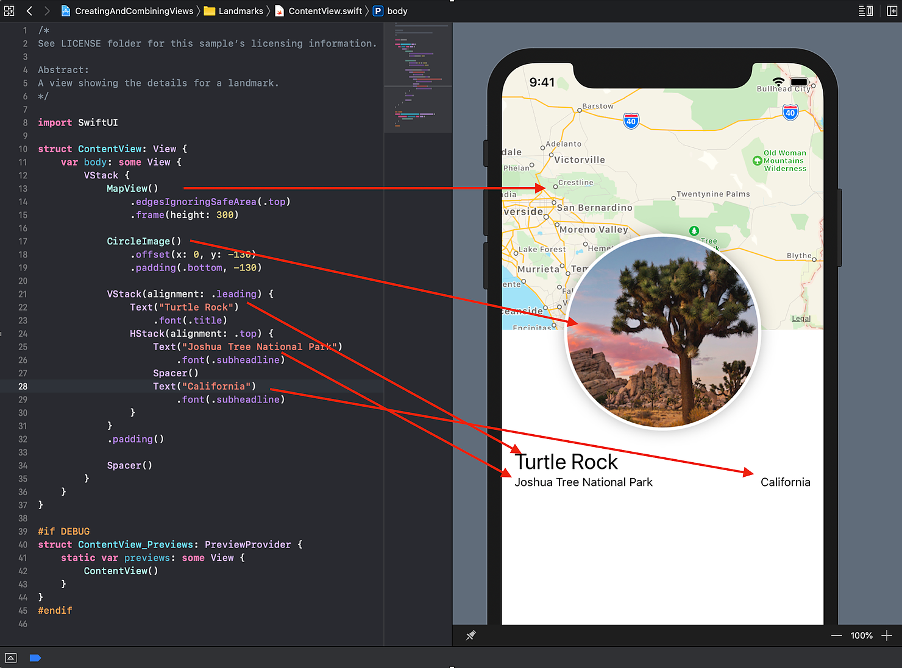

# Chapter 1: Introduction

## What is SwiftUI

SwiftUI was announced by Apple at the WWDC19 event and is described as “an innovative, exceptionally simple way to build user interfaces across all Apple platforms with the power of Swift”. In fact, SwiftUI makes it amazingly easy to build your apps exactly the way you want them to look.

Until now, the most common way to build iOS apps was to use storyboards. Simplified, you created the UI (user interface) of your app by dragging and dropping, arranging and constraining elements and by connecting them to your code. But to see the result you had to compile and run your app every time you made changes to it.

This not only took up unnecessary time each time but could also easily interrupt your workflow

As already mentioned, when working with storyboards, you always had to deal with two “layers”: The storyboard UI on one side and the written code on the other side. Since these layers can easily differ, this approach often led to unforeseen bugs and crashes.

> Building apps with old-school storyboards often leads to lack of visual feedback, bugs and frustration.

With SwiftUI, Apple introduced a new framework that works completely different. Instead of having two separate layers to work with, the UI and the written code, SwiftUI combines and merges them. This becomes more comprehensible when we look at how the SwiftUI framework approach works.

With SwiftUI, you use code to describe how your app should look. With this new syntax approach, you just describe how your interface should look and how it should behave.

Look at the image above. You see that every piece of the UI – the map, the circled image and the texts – is described by code. And that is the great advantage of using SwiftUI! Everything you write in code is immediately reflected in your live preview. No more time-intense run & compile workflow anymore. Everything you describe in your code is also displayed directly and you already know how your app will look like.

That’s not all! You can even manipulate the UI inside the live pBut that’s not all. You can even manipulate the UI inside the live preview itself. For example, you can drop and drag another text object or manipulate the color of a certain object, as you’ll see later on. Every change in the live preview also affects your code and vice versa.

This new workflow saves us a lot of time and makes app building much more intuitive. Because code and UI are always linked and dependent on each other, you don’t have to worry about broken outlets and actions anymore.
