# Realtime Chat Messenger – Firebase and SwiftUI

- How to work with realtime databases such as Firebase in SwiftUI
- How to implement a Notification Center and listen to system notifications
- Storing small pieces of data by using UserDefaults

## Firebase

1 - Setup Firebase project

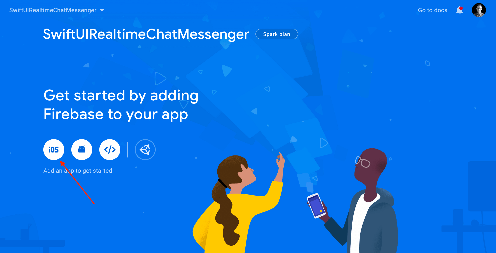

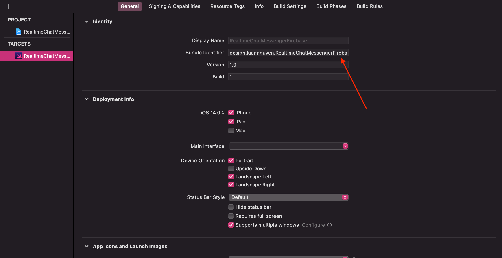

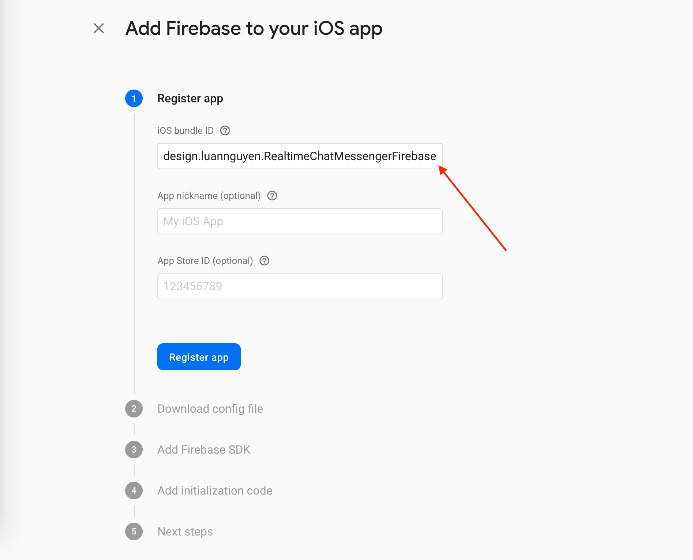

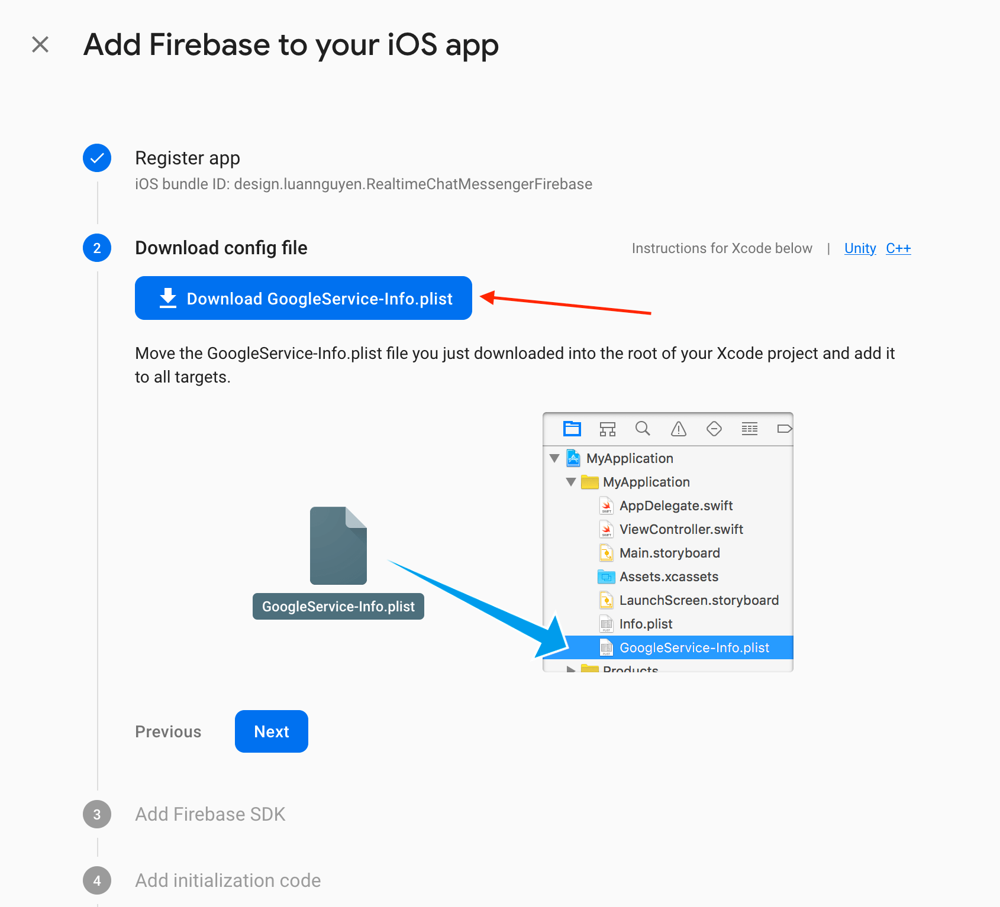

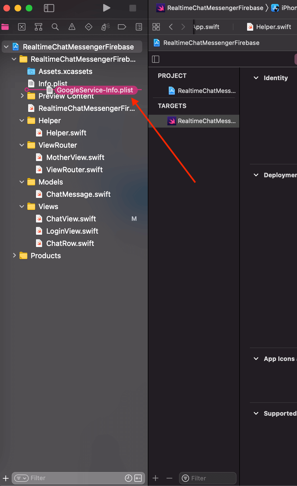

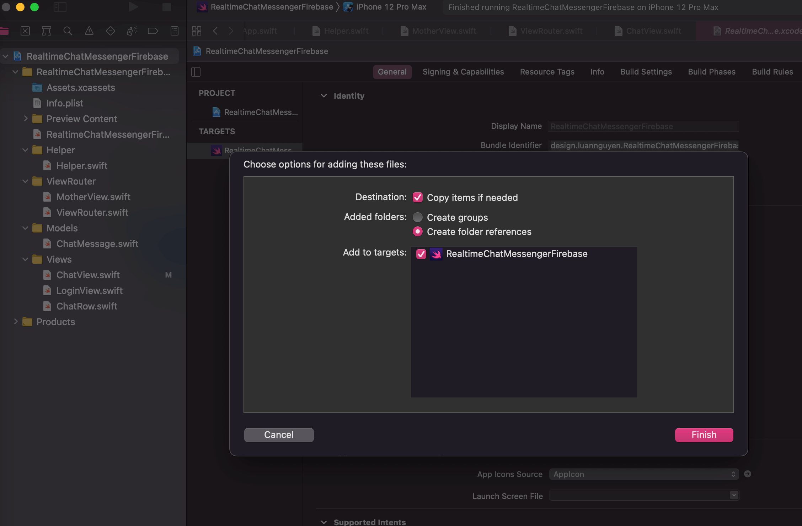

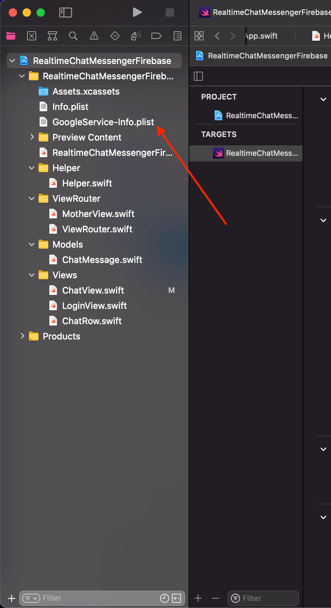

2 - Setup iOS project

3 - Copy `GoogleService-Info.plist` into project and restart Xcode project

4 - Run `pod init`

5 - Open `Podfile`

```
# Uncomment the next line to define a global platform for your project
# platform :ios, '9.0'

target 'RealtimeChatMessengerFirebase' do
  # Comment the next line if you don't want to use dynamic frameworks
  use_frameworks!

  # Pods for RealtimeChatMessengerFirebase
  pod 'Firebase/Core'
  pod 'Firebase/Storage'
  pod 'Firebase/Auth'
  pod 'Firebase/Database'

end
```

6 - Run `pod install`

7 - Open `RealtimeChatMessengerFirebase.xcworkspace`

## Create Firebase Database

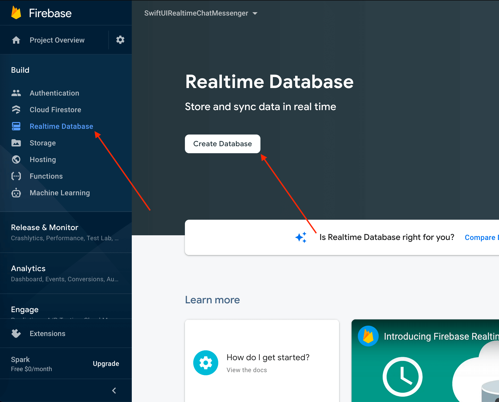

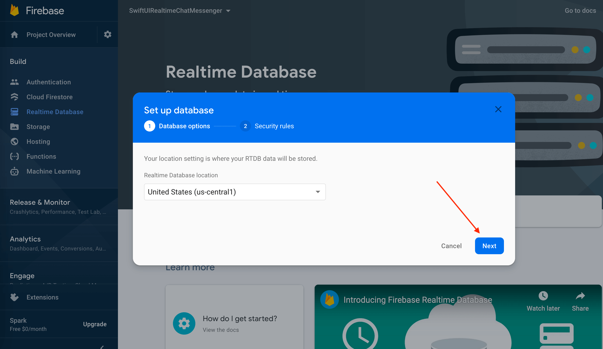

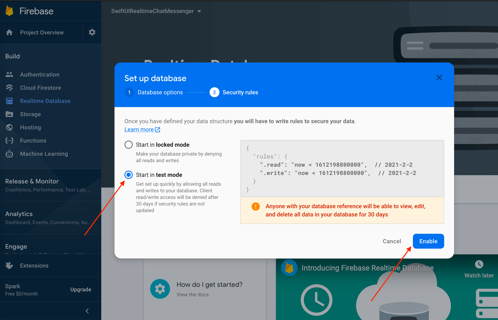

## Our Database Structure

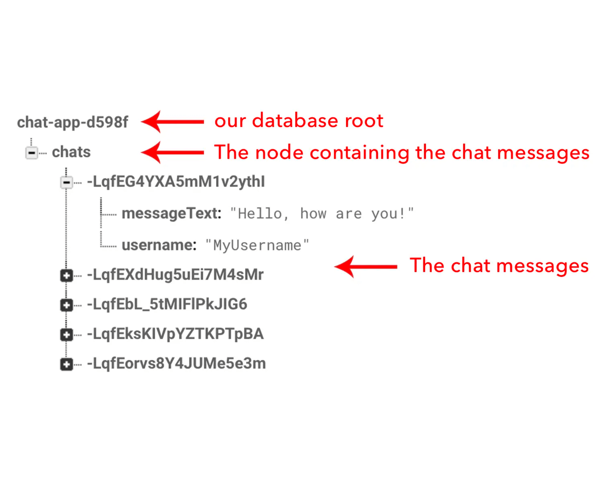

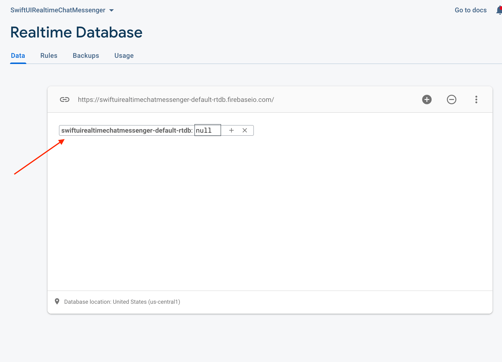

## My First Message

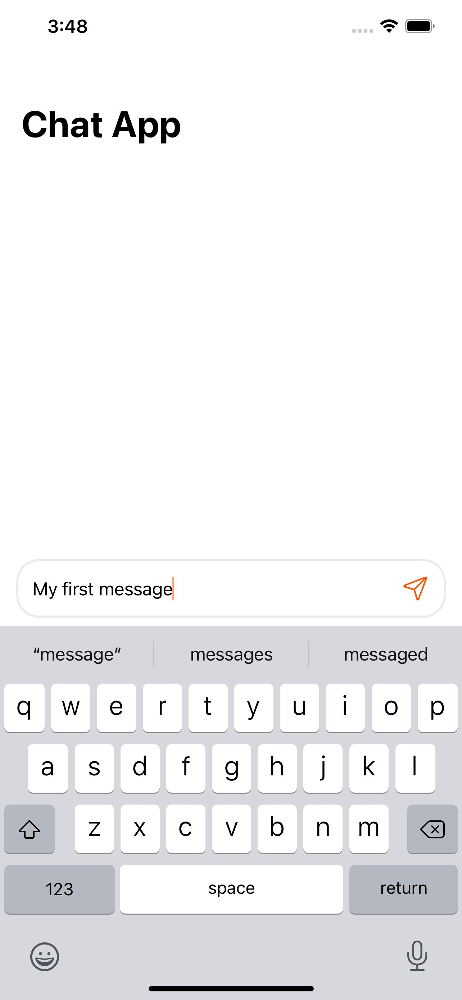

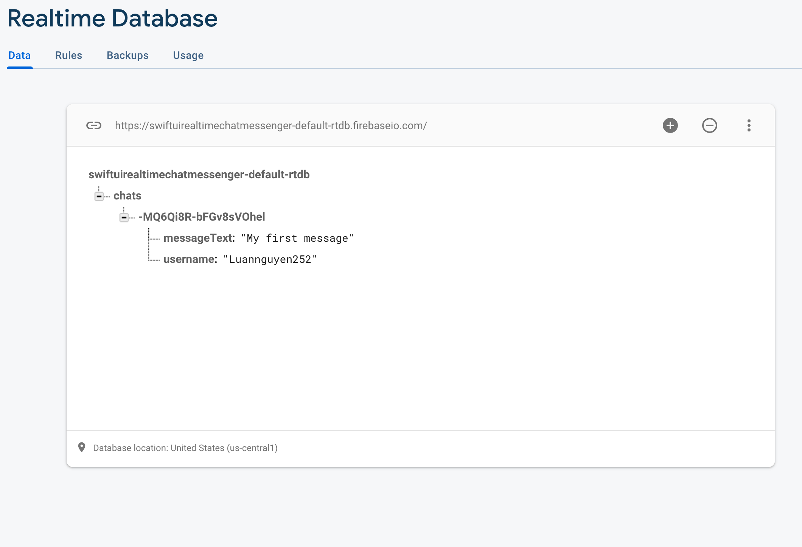

---

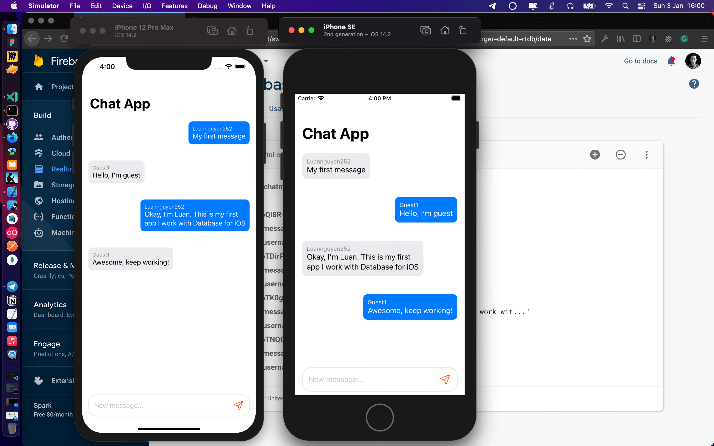

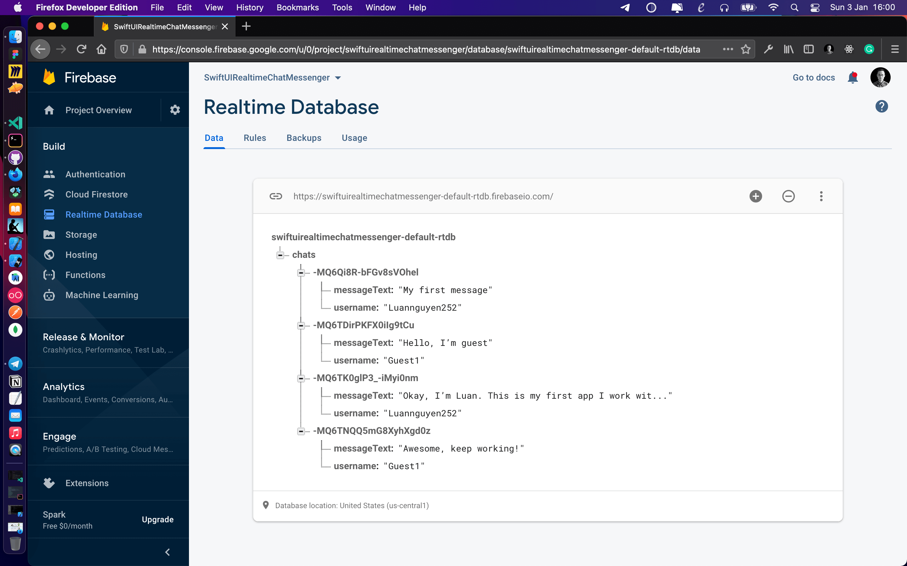
