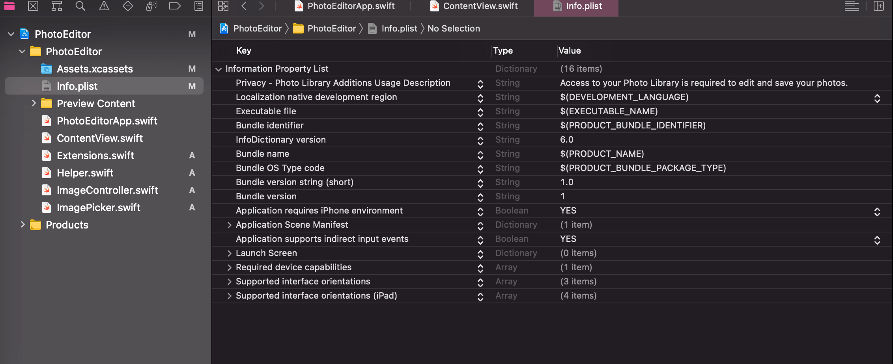

# Photo Filter App – CoreImage and SwiftUI

- How to access the user’s image gallery using a PHPicker to retrieve and save photos
- Interfacing with UIKit and integrating UIViewControllers in SwiftUI applications
- Image processing with CoreImage to create filter effects
- Practicing ObservableObjects and EnvironmentObjects

## Privacy – Photo Library Additions Usage Description

- Go to `Info.plist`
- `Privacy – Photo Library Additions Usage Description`

## Core Image Filter Reference

[Core Image Filter Reference](https://developer.apple.com/library/archive/documentation/GraphicsImaging/Reference/CoreImageFilterReference/index.html)
