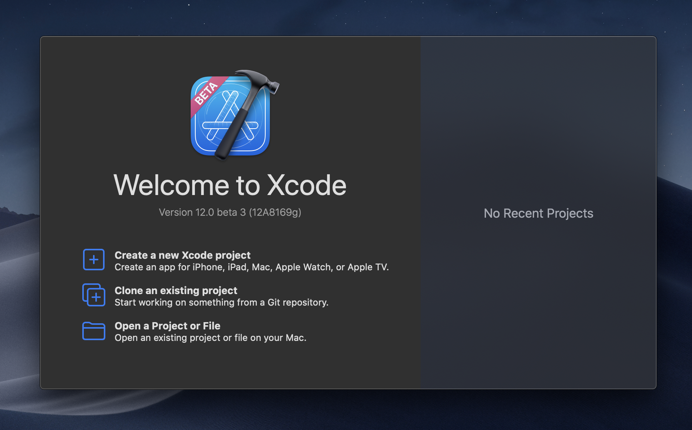
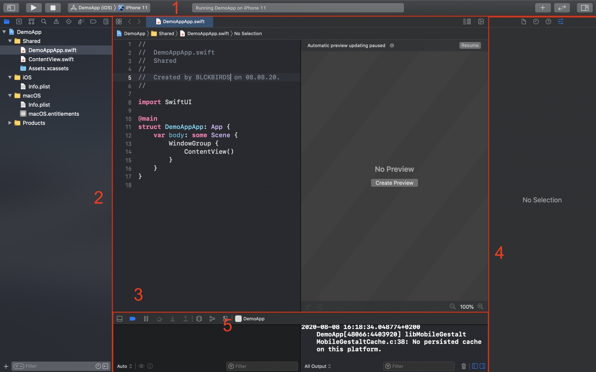
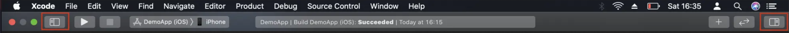
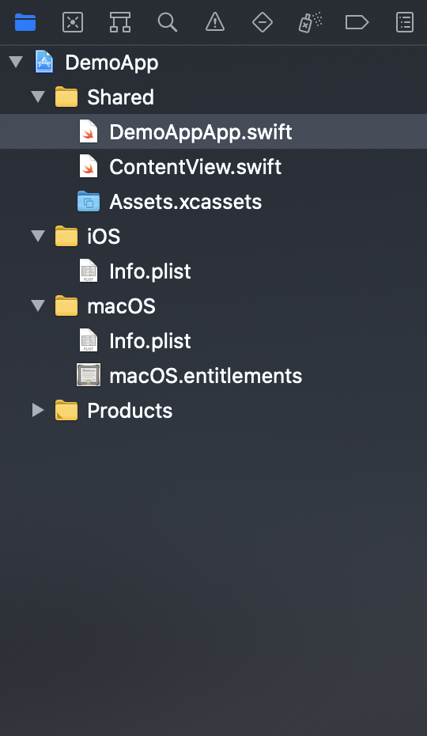
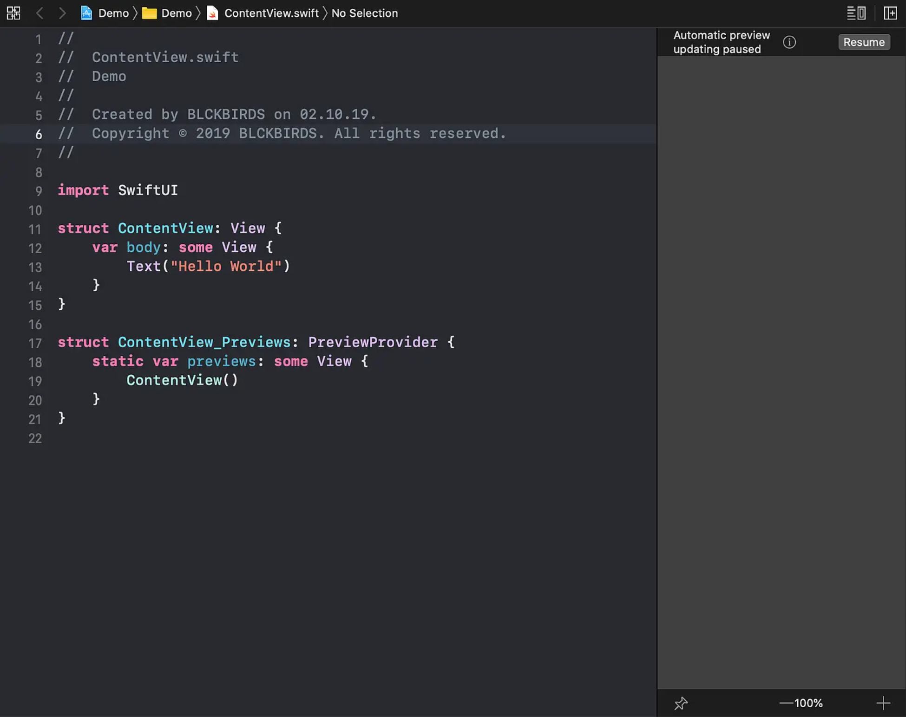
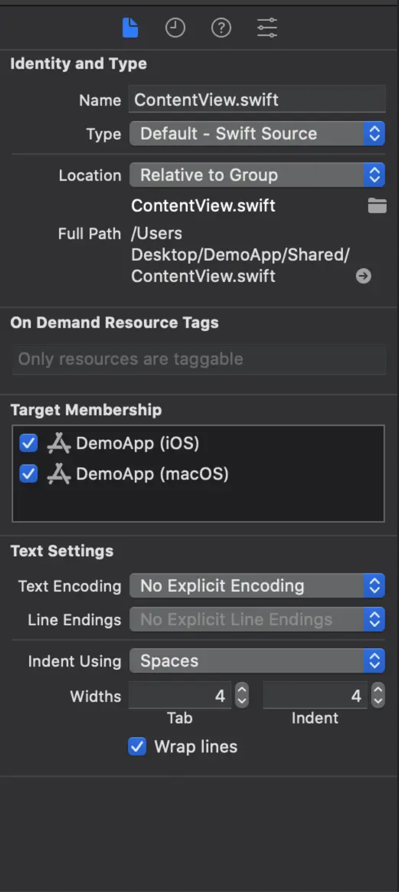
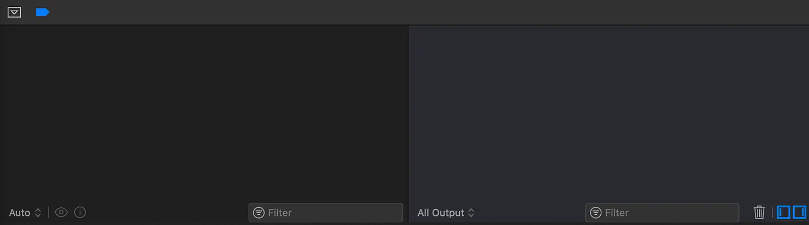

# Chapter 2: Introduction to Xcode 12

## What is Xcode used for?

Xcode is Apple’s in-house IDE (Integrated Development Environment). For developing iOS apps, Xcode is the software you will work most often with. Therefore, it is very important to have a profound knowledge of Xcode and to master the basics from scratch.

## Creating a new Xcode project

To get in touch with the IDE, just open Xcode and click on “Create a new Xcode Project”.

Next, click on “App“ under the “Multiplatform” section, then on “Next” and give your app any name you want, for example “DemoApp”.

This feeling is normal and will vanish as soon as you get to know the basic structure and functionality of Xcode.

Fortunately, the interface of Xcode is designed pretty straight forward. The interface you see now basically consists of five main sections. Don’t worry if you don’t see all the sections just yet. We’ll learn how to toggle the different sections if we go through each of them one by one.

These are: The Toolbar (1), the Navigator Area (2), the Editor Area (3), the Utility Area (4), and the Debug Area (5). Don’t worry if you don’t see all the sections just yet. We’ll learn how to toggle the different sections if we go through each of them.

## The Toolbar

Using the toolbar we can access the basic Xcode settings (not to be mixed up with the settings of your app project) and perform various operations. On the left side of the toolbar, you can select the device on which you want to run your app, for instance, on any simulator. The area in the center tells you when Xcode is working on something. Using the left and right buttons you can toggle the navigator and utility area.

## The Navigator Area

The Navigator Area helps you finding your way around your project and organizing your code and resources.

By default, the “Project Navigator” is selected (you recognise this by looking at the highlighted symbol) and is probably the most important mode of the navigator area. This is where the different parts of your app’s code listed. The more complex your app becomes, the more files your project will contain. To keep track of them, you can create “groups” (Xcode’s name for folders) and move the files around as you like. Where you are placing files within your project navigator, does not affect the logic of your code or the behavior of the app.

When you click on a file, it will open in the Editor Area where you can edit it. If not already done, click on “ContentView.swift” to display this file in the Editor Area. Swift files are the heart of every iOS App. In these, you write the code that makes your app run.

**Excursus:**

With Xcode 12 and SwiftUI, Apple is encouraging developers even more to develop apps that run cross-platform on iOS, iPadOS and macOS.

This is noticeable by the fact that Xcode 12 automatically generates so-called multiplatform app templates for us. In the Navigator Area, you can see a group folder “Shared”, which contains e.g. the view files that are used by all platforms (iOS, iPadOS and macOS). There are also other folders where platform-specific adjustments can be made. For example, the iOS group only contains files that are relevant for running the app on iOS devices.

Although this course focuses on developing iOS apps using SwiftUI, all files can also be stored within the “Shared” group since those files can also be used for running the apps we will create on macOS.

## The Editor Area

Here you write the code and compose the interface of your app. The appearance of the Editor Area depends on which file type is opened.

## The Utility Area

Similar to the Editor Area, the appearance of the Utility Area depends on what file type you have selected. Here you can access meta information, references, etc. of files or/and their components. This area often confuses beginners because the use of this area depends on the particular situation. But the more you work with Xcode, the more you will get the hang for it. You’ll see, it’s much easier than it looks.

## The Debug Area

This area opens once you run your app by clicking the run symbol in the Xcode toolbar.

If you run your app you will find all relevant information like runtime error messages and executed print statements in this area. This area becomes very important when it comes to finding and fixing errors and bugs inside your app.
