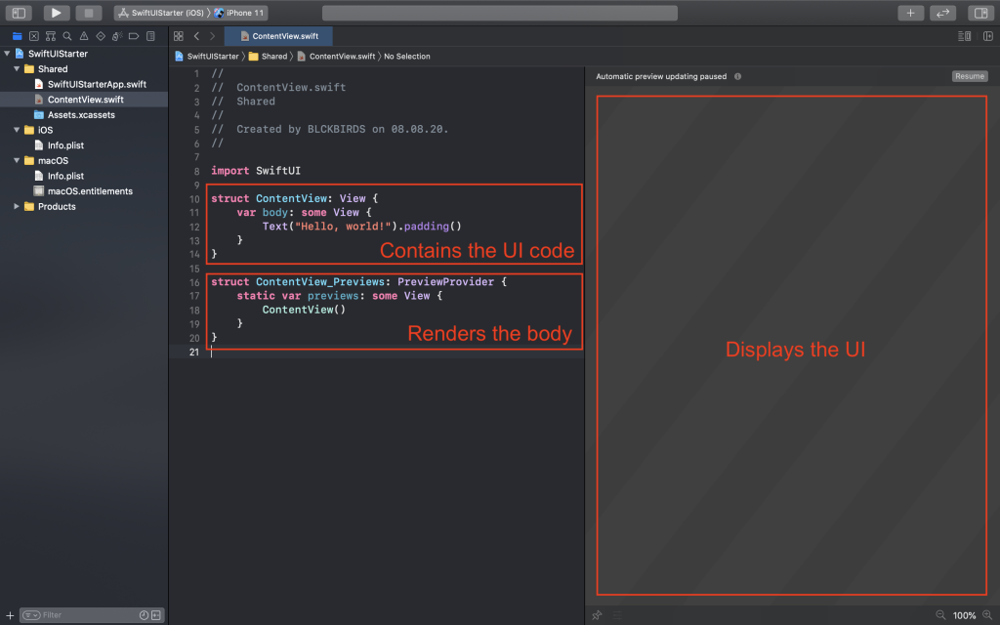
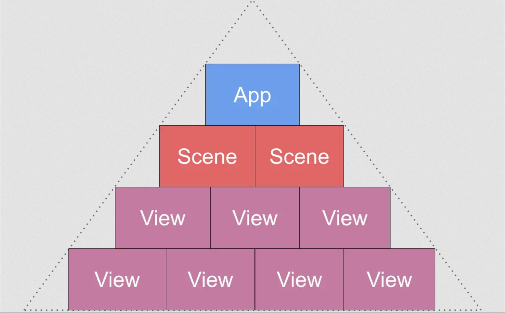
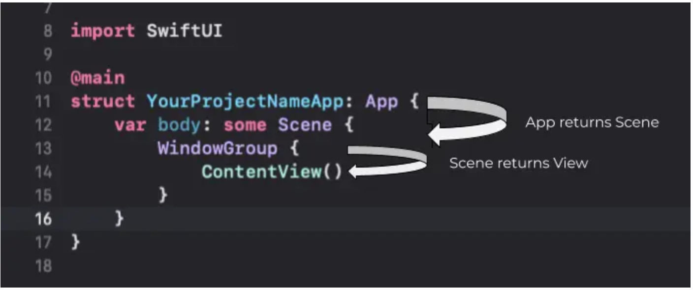

# Chapter 3 – Getting started with SwiftUI

- **The View struct:** This struct is the place where we write the code for building up the interface for our app. You see that the struct itself contains a body property. Inside this body, we create, arrange and modify all the components we need for our UI.

- **The Previews struct:** This struct is used for rendering its related View including its body and displays the rendered View in the preview Simulator on the right screen.

Every time you make some changes within your View struct, the Previews struct notices and displays the updated View inside the live preview.

> The Preview struct renders the View struct and sends it to the live preview

