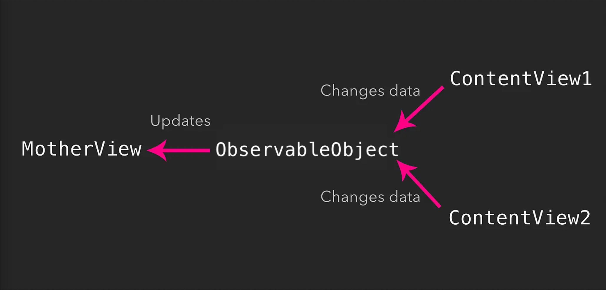
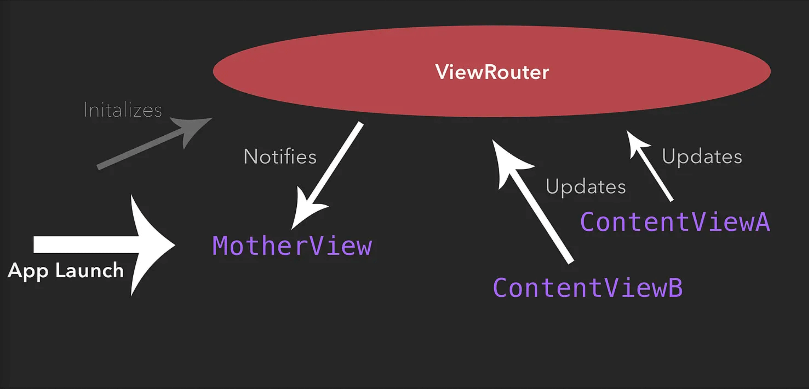

# Independent navigation between views in SwiftUI

- How to navigate between views without relying on a navigation view hierarchy
- More advanced data flow techniques including @ObservableObjects, @StateObjects and @EnvironmentObjects
- First look at using animations in SwiftUI

## @ObservableObjects

ObservableObjects are similar to State properties which you should already know. But instead of just rerendering at the body of the related view when the data assigned to the State changes, ObservableObjects are capable of the following things:

- Instead of variables, ObservableObjects are classes that can contain data, for example, a String assigned to a variable

- We can bind multiple views to the ObservableObject (in other words: we can make these views observe the ObservableObject). The observing views can access and manipulate the data inside the ObservableObject

- When a change happens to the ObservableObject’s data, all observing views get automatically notified and rerendered similar to when the value assigned to a State changes

## @EnvironmentObject

An EnvironmentObject is a data model that, once initialised, can be used to share information across all view’s of your app. The cool thing is, that an EnvironmentObject is created by supplying an ObservableObject. Thus we can use our ViewRouter as it its for creating an EnvironmentObject!

