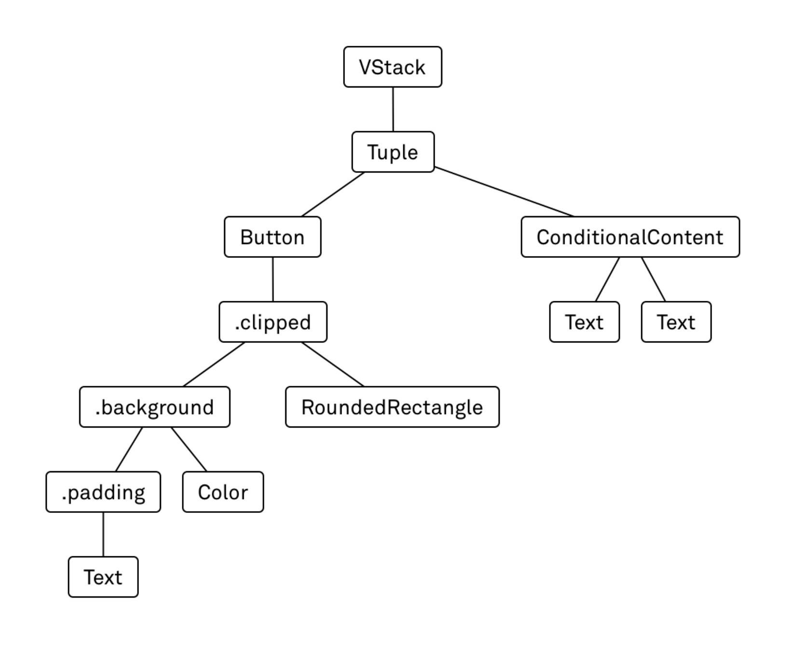

# Overview

- How SwiftUI works and how it works differently from frameworks like UIKit.

- SwiftUI is a radical conceptual departure from the previous way of developing apps on Apple’s platforms, and it requires you to rethink how to translate an idea you have in mind into working code.

"The only way to learn a new programming language is by writing programs in it." — Dennis Ritchie

## View Construction Counter

- To construct views in SwiftUI, you create a tree of view values that describe what should be onscreen.

- To change what’s onscreen, you modify state, and a new tree of view values is computed.

- SwiftUI then updates the screen to reflect these new view values.

- For example, when the user taps the counter button, we should increment our state and let SwiftUI rerender the view tree.

**Note:** At the time of writing, Xcode's built-in previews for SwiftUI, Playgrounds, and the simulator don't always work. When you see unexpected behavior, make sure to doublecheck on a real device.





## View Builders

- SwiftUI relies heavily on view builders to construct the view tree.

- A view builder looks similar to a regular Swift closure expression, but it only supports a very limited syntax.

- While you can write any kind of expression that returns a View, there are only a few statements you can write.

## Compared to UIKit

- View construction in UIKit means building up a tree of view controllers and view objects, which can be modified later on to update the contents of the screen.

- View construction in SwiftUI refers to an entirely different process, because there are no instances of view classes in SwiftUI.

- When we talk about views, we’re talking about short-lived values conforming to the View protocol. These values describe what should be onscreen, but they do not have a one-to-one relationship to what you see onscreen like UIKit views do: view values in SwiftUI are transient and can be recreated at any time.

- Another big difference is that in UIKit, view construction for the counter app would only be one part of the necessary code; you’d also have to implement an event handler for the button that modifies the counter, which in turn would need to trigger an update to the text label. View construction and view updates are two different code paths in UIKit.

- SwiftUI code paths are unified: there is no extra code we have to write in order to update the text label onscreen. Whenever the state changes, the view tree gets reconstructed, and SwiftUI takes over the responsibility of making sure that the screen reflects the description in the view tree.

## View Layout

- SwiftUI starts the layout process at the outermost view.

- `ContentView` containing a single `VStack`.

```swift
struct ContentView: View {
    var body: some View {
        VStack { ... }
    }
}
```

- The layout system offers the `ContentView` the entire available space, since it’s the root view in the hierarchy.

- The `ContentView` then offers the same space to the `VStack` to lay itself out.

- The `VStack` divides the available vertical space by the number of its children, and it offers this space to each child (this is an oversimplification of how stacks divide up the available space between their children)

```swift
VStack {
// ...
}.frame(width: 200, height: 200)
```

```
ModifiedContent<VStack<...>, _FrameLayout>
```

## View Updates

Properties that need to trigger view updates are marked with the `@State`, `@ObservedObject`, or `@StateObject` property attributes

## Takeaways

- SwiftUI views are values, not objects: they are immutable, transient descriptions of what should be onscreen.

- Almost all methods we call on a view (like frame or background) wrap the view in a modifier. Therefore, the sequence of these calls matters, unlike with most UIView properties.

- Layouts proceed top down: parent views offer their available space to their children, which decide their size based on that.

- We can’t update what’s on screen directly. Instead, we have to modify state properties (e.g. @State or @ObservedObject) and let SwiftUI figure out how the view tree has changed.
