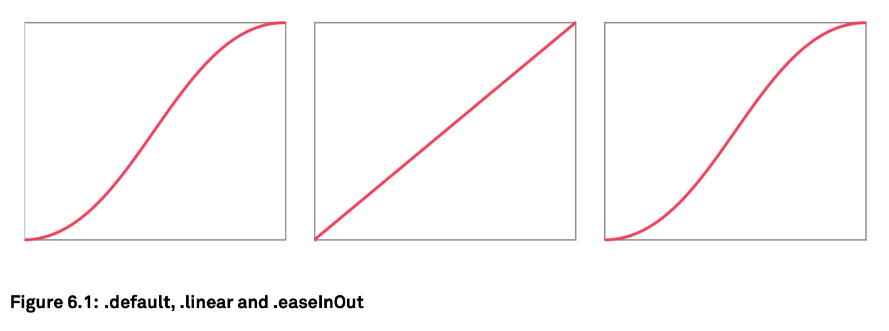
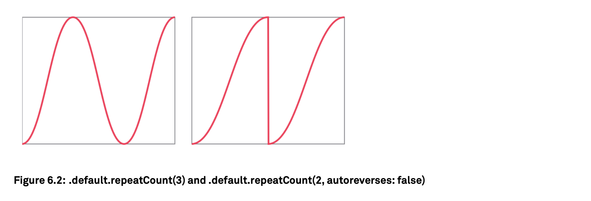
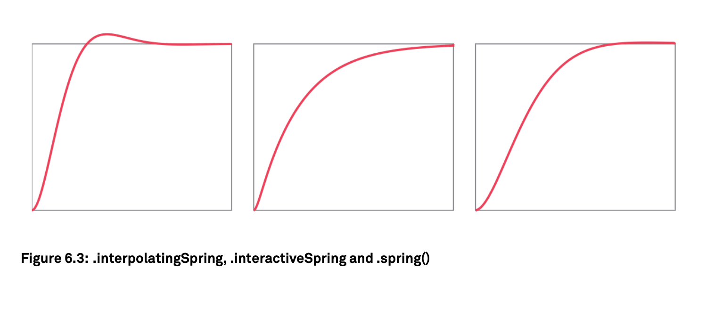

# Animations

- Since the very beginning of iOS, animations have been a key part of the user experience.

- Scroll views animate their content fluidly and have a bounce animation when they reach the end. Likewise, when you tap an app icon on your home screen, the app animates in from the icon's position. These animations aren't just ornamental; they provide the user with context.

- SwiftUI has animations built into it from the start. You can use implicit animations and explicit animations, and you can even take full manual control of how things move over time onscreen.

## Implicit Animations

An implicit animation is part of the view tree: by adding an `.animation` modifier to a view, any change to that view is automatically animated.

```swift
struct ContentView: View {
    @State var selected: Bool = false

    var body: some View {
        Button(action: { self.selected.toggle() }) {
            RoundedRectangle(cornerRadius: 10)
                .fill(selected ? Color.red : .green)
                .frame(width: selected ? 100 : 50, height: selected ? 100 : 50)
            }
            .animation(.default)
    }
}
```

- Animations in SwiftUI are part of the view update system.

- Like other view updates, animations can only be triggered through state changes

- When we add a modifier like `.animation(.default)` to a view tree, SwiftUI animates the changes between the old and the new view tree on view updates.

```swift
struct LoadingIndicator: View {
    @State private var animating = false

    var body: some View {
        Image(systemName: "rays")
            .rotationEffect(animating ? Angle.degrees(360) : .zero)
            .animation(Animation
                .linear(duration: 2)
                .repeatForever(autoreverses: false)
            )
            .onAppear {
                self.animating = true
            }
    }
}

```

## Transitions

```swift
struct ContentView: View {
    @State var visible = false

    var body: some View {
        VStack {
            Button("Toggle") {
                self.visible.toggle()
            }

            if visible {
                Rectangle()
                    .fill(Color.blue)
                    .frame(width: 100, height: 100)
                    .transition(.slide)
                    .animation(.default)
            }
        }
    }
}
```

## Matched Geometry Effect

```swift
VStack {
    HStack {
        if !state {
            Rectangle()
                .fill(blue)
                .matchedGeometryEffect(id: "1", in: ns)
                .frame(width: 200, height: 200)
            }

        Spacer()

            if state {
                Circle()
                    .fill(blue)
                    .matchedGeometryEffect(id: "1", in: ns)
                    .frame(width: 100, height: 100)
                }
            }
            .border(Color.black)
            .frame(width: 300, height: 200)

        Toggle("", isOn: $state)
    }
    .animation(.default)
```

```swift
struct NoOpTransition: AnimatableModifier {
    var animatableData: CGFloat = 0
    init(_ x: CGFloat) {
        animatableData = x
    }

    func body(content: Content) -> some View {
        return content
    }
}

extension AnyTransition {
    static let noOp: AnyTransition = .modifier(active: NoOpTransition(1), identity: NoOpTransition(0))
}
```

## Pitfalls

Keep in mind that whenever you try to match the size of one view to another, the view being matched actually needs to be flexible enough to take on the source view’s size.

---

# How Animations Work

```swift
struct AnimatedButton: View {
    @State var selected: Bool = false

    var body: some View {
        Button(action: {
            self.selected.toggle()
        }) {
            RoundedRectangle(cornerRadius: 10)
                .fill(Color.green)
                .frame(width: selected ? 100 : 50, height: 50)
            }
            .animation(.linear(duration: 5))
    }
}
```

- SwiftUI computes the current value of an animatableData property as `startValue + (endValue - startValue) * progress`.

- When specifying an implicit animation (like `.animation(.default)`) for a view subtree, all the animatable properties within that subtree will get animated.

- We can also call `.animation(nil)`, which disables all animations (even explicit ones) within that subtree.

```swift
struct ContentView: View {
    @State var selected: Bool = false

    var body: some View {
        Button(action: {
            self.selected.toggle()
        }) {
            RoundedRectangle(cornerRadius: 10)
                .fill(selected ? Color.red : .green)
                .animation(nil) // Which disables all animations
                .frame(width: selected ? 100 : 50, height: 50)
            }
            .animation(.linear(duration: 5))
    }
}
```

```swift
Button(action: {
    self.selected.toggle()
    }) {
        RoundedRectangle(cornerRadius: 10)
            .fill(selected ? Color.red : .green)
            .animation(nil)
            .frame(width: selected ? 100 : 50, height: 50)
            .rotationEffect(Angle.degrees(selected ? 45 : 0))
        }
        .animation(.linear(duration: 5))
```

## Animation Curves

- Linear animations `.linear(duration: 5)` often look unnatural when run at normal speed, we can use other built-in animation curves

- An ease-in/ease-out curve that specifies `.easeInOut(duration: 0.35)` to start the movement slow, then pick up speed, and finally slow down again.

- An animation curve can be seen as a function that takes time as the input and returns how far the animation has progressed at that point in time.



```swift
Rectangle()
    .fill(selected ? Color.red : Color.green)
    .animation(Animation.default.repeatCount(3))
```





- One interesting property of the way SwiftUI implements animations is that additive animations are supported by design.

- When the state changes while we’re in the middle of an animation, the new animation starts from the current state of the previous animation.

---

## Explicit Animations

- When we create an implicit animation, anytime the view tree is recomputed, changes of animatable properties in this view tree are animated.

- Although this is convenient, implicit animations sometimes produce surprising effects.

```swift
struct LoadingIndicator: View {
    @State var appeared = false
    let animation = Animation.linear(duration: 2).repeatForever(autoreverses: false)

    var body: some View {
        Circle()
            .fill(Color.accentColor)
            .frame(width: 5, height: 5)
            .offset(y: -20)
            .rotationEffect(appeared ? Angle.degrees(360) : .zero)
            .animation(animation)
            .onAppear {
                self.appeared = true
            }
    }
}
```

```swift
Circle()
    .fill(Color.accentColor)
    .frame(width: 5, height: 5)
    .offset(y: -20)
    .rotationEffect(appeared ? Angle.degrees(360) : .zero)
    .onAppear {
        withAnimation(self.animation) { self.appeared = true }
    }
```

---

## Custom Animations

```swift
struct Shake: AnimatableModifier {
    var times: CGFloat = 0
    let amplitude: CGFloat = 10

    var animatableData: CGFloat {
        get { times }
        set { times = newValue }
    }

    func body(content: Content) -> some View {
        return content.offset(x: sin(times * .pi * 2) * amplitude)
    }
}
```

- To expose two properties as animatable, we can wrap them in an `AnimatablePair`. We can nest `AnimatablePairs` inside each other to support any number of properties.

```swift
extension View {
    func shake(times: Int) -> some View {
        return modifier(Shake(times: CGFloat(times)))
    }
}
```

```swift
struct ContentView: View {
    @State private var taps: Int = 0

    var body: some View {
        Button("Hello") {
            withAnimation(.linear(duration: 0.5)) {
                self.taps += 1
            }
        }
        .shake(times: taps * 3)
    }
}
```

- To examine how SwiftUI interpolates between different values during an animation, we can add log statements to the setter of `animatableData` or the body method of the animatable modifier.

```swift
struct ShakeEffect: GeometryEffect {
    var times: CGFloat = 0
    let amplitude: CGFloat = 10
    var animatableData: CGFloat {
        get { times }
        set { times = newValue }
    }

    func effectValue(size: CGSize) -> ProjectionTransform {
        ProjectionTransform(CGAffineTransform(translationX: sin(times * .pi * 2) * amplitude, y: 0 ))
    }
}
```

---

## Custom Transitions

To customize view insertion and removal animations, we can create a custom transition using the `AnyTransition.modifier(active:identity:)` method. This method takes two view `modifiers:` one for when the transition is `active`, and one for when the transition has `completed`.

```swift
struct Blur: ViewModifier {
    var active: Bool

    func body(content: Content) -> some View {
        return content
            .blur(radius: active ? 50 : 0)
            .opacity(active ? 0 : 1)
        }
}
```

```swift
extension AnyTransition {
    static var blur: AnyTransition {
        .modifier(active: Blur(active: true), identity: Blur(active: false))
    }
}
```

---

## Takeaways

- Animations,like view updates, are triggered by state changes.

- Implicit animations(`.animation(...)`) animate changes to all animatable properties
  in the view subtree.

- Using explicit animations(`withAnimation{...}`) allows for more control and can prevent unwanted side effects.

- Use transitions to animate the insertion and removal of views. It's possibleto combine transitions, use different transitions for insertion and removal, and create custom transitions.

- To build custom animations, implement an animatable view modifier (conforming to the `AnimatableModifier` protocol) or a `GeometryEffect` and expose the animatable properties as `animatableData`.
