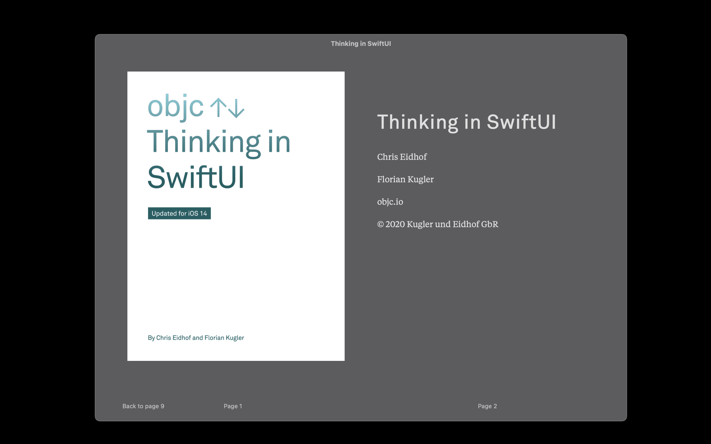

# Thinking in SwiftUI - A Transition Guide

> SwiftUI is radically different from UIKit. In this short book, we will help you build a mental model of how SwiftUI works. We explain the most important concepts in detail, and we follow them up with exercises to give you hands-on experience. Since SwiftUI is still in its early days, the book focuses on the concepts behind the framework that we believe are essential to understand. It is not a reference for SwiftUI’s platform-specific APIs, but rather a guide to honing your intuition about how SwiftUI works. Thinking in SwiftUI is geared toward developers who have both prior experience with Apple’s platforms and a good understanding of the Swift language.

Book: [Thinking in SwiftUI](https://www.objc.io/books/thinking-in-swiftui/)

Source Code: [Thinking in SwiftUI Source Code](https://github.com/objcio/thinking-in-swiftui-sample-code/)

---

## Introduction

[Introduction](./01-Introduction/README.md)

## Overview

[Overview](./02-Overview/README.md)

## View Updates

[View Updates](./03-View-Updates/README.md)

## Environment

[Environment](./04-Environment/README.md)

## Layout

[Layout](./05-Layout/README.md)

## Custom Layout

[Custom Layout](./06-Custom-Layout/README.md)

## Animations

[Animations](./07-Animations/README.md)

## Conclusion

[Conclusion](./08-Conclusion/README.md)

## Exercise Solutions

[Exercise Solutions](./09-Exercise-Solutions/README.md)
