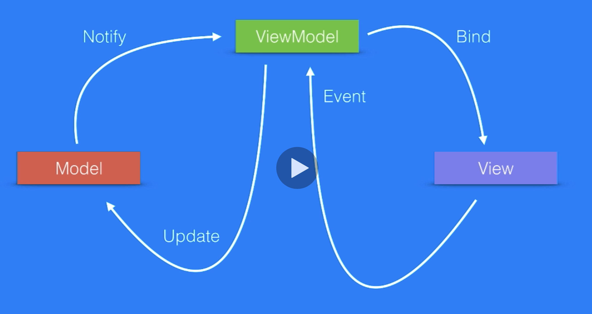

# MVVM Design Pattern in SwiftUI

> Covers consuming JSON, Client-Server MVVM architecture, Screen-View Pattern

---

[MVVM Design Pattern in SwiftUI](https://www.udemy.com/course/mvvm-design-pattern-in-swiftui/)

---

## What are Design Patterns?

- Best practices
- Relationships between classes and objects
- Speed up development
- Programming independent
- Flexible, reusable and maintainable

## MVVM

- M: Model
- V: View
- V: View
- M: Model

