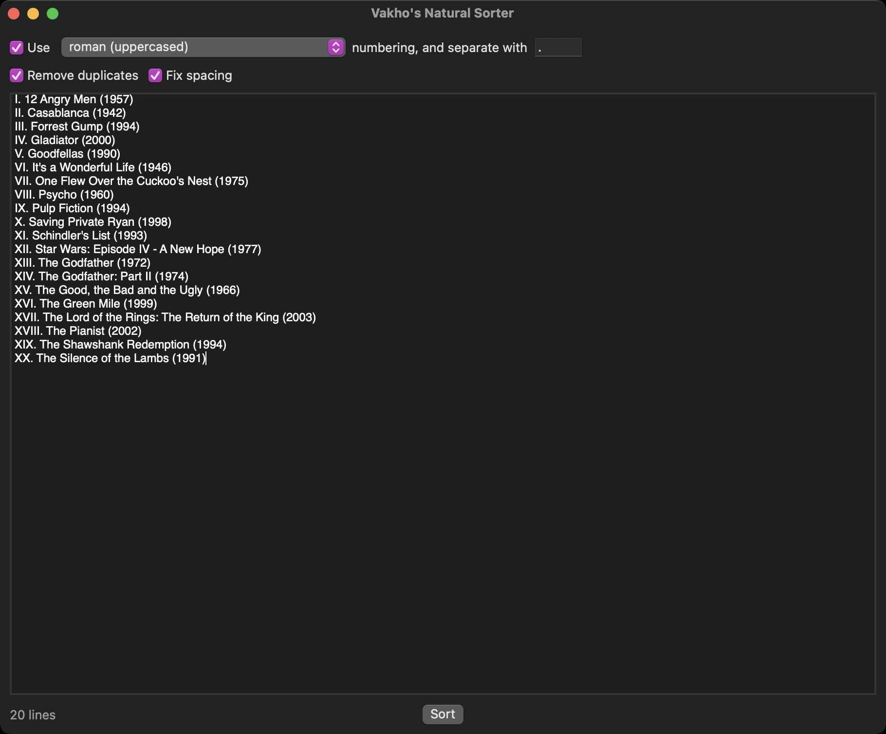

# Vakho's Natural Sorter

## Table of Contents
- [Description](#description)
- [Technologies](#technologies)
- [Setup](#setup)
- [Examples](#examples)
- [Contact](#contact)
- [Copyright](#copyright)

## Description
Vakho's Natural Sorter is an open-source utility app for macOS. You can use the app to sort text using a nautral sort order.

#### General Features:
- Sort text using natural sort order, meaning, content of the lines would be read as contextual tokens and not string of characters. For instance, lines "File 2" and "File 11" would be sorted in this order, and not the other way around.

## Technologies
App was developed on macOS 11.0 Big Sur in XCode 12. UI was build using SwiftUI, and no external libraries and frameworks were used.

## Setup
You can simply clone the project and build the app from XCode.

## Examples

## Contact
e-mail: [vakho.kontridze@gmail.com](mailto:vakho.kontridze@gmail.com)

## Copyright
MIT License

Copyright (c) 2020 Vakhtang Kontridze

Permission is hereby granted, free of charge, to any person obtaining a copy
of this software and associated documentation files (the "Software"), to deal
in the Software without restriction, including without limitation the rights
to use, copy, modify, merge, publish, distribute, sublicense, and/or sell
copies of the Software, and to permit persons to whom the Software is
furnished to do so, subject to the following conditions:

The above copyright notice and this permission notice shall be included in all
copies or substantial portions of the Software.

THE SOFTWARE IS PROVIDED "AS IS", WITHOUT WARRANTY OF ANY KIND, EXPRESS OR
IMPLIED, INCLUDING BUT NOT LIMITED TO THE WARRANTIES OF MERCHANTABILITY,
FITNESS FOR A PARTICULAR PURPOSE AND NONINFRINGEMENT. IN NO EVENT SHALL THE
AUTHORS OR COPYRIGHT HOLDERS BE LIABLE FOR ANY CLAIM, DAMAGES OR OTHER
LIABILITY, WHETHER IN AN ACTION OF CONTRACT, TORT OR OTHERWISE, ARISING FROM,
OUT OF OR IN CONNECTION WITH THE SOFTWARE OR THE USE OR OTHER DEALINGS IN THE
SOFTWARE.
