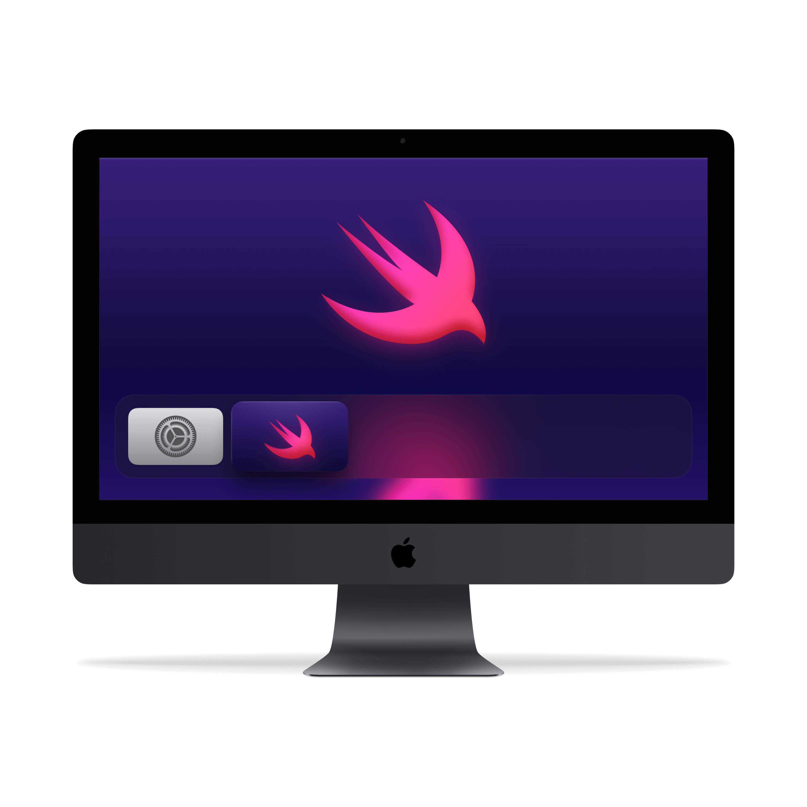

# My First tvOS App

> Build a tvOS application with SwiftUI.

---

- Designing for Apple TV (Apple TV 4K)
- Design tvOS Assets
- Setup tvOS Project
- SwiftUI tvOS
- SwiftUI Grid
- Xcode 12 Swift 2.0

---

## Resources

- [tvOS Resources](https://github.com/hamishtaplin/tvos-resources)

- [Curated list of tutorials and sample apps for tvOS](https://github.com/sanketfirodiya/tvOS)

- [Awesome tvOS](https://github.com/mbcrump/awesome-tvos)

---

## Further Reading

- [tvOS App Icon](https://developer.apple.com/design/human-interface-guidelines/tvos/icons-and-images/app-icon/)

- [How to set up App Icons for tvOS Apps in Xcode](https://stackoverflow.com/questions/33459088/how-to-set-up-app-icons-for-tvos-apps-in-xcode)

- [Introduction to tvOS: Building Your First tvOS App](https://www.appcoda.com/tvos-introduction/)

- [Hacking with tvOS](https://www.hackingwithswift.com/store/hacking-with-tvos)

- [tvOS Top Shelf Tutorial: Static and Interactive](https://www.raywenderlich.com/933-tvos-top-shelf-tutorial-static-and-interactive)

- [Top Shelf Image](https://developer.apple.com/forums/thread/61773)

- [Top Shelf](https://developer.apple.com/design/human-interface-guidelines/tvos/overview/top-shelf/)

- [5 Apple TV App Marketing Tips](https://www.apptamin.com/blog/apple-tv-app-marketing-tips/)

- [tvOS Tutorial - Make Apple TV Apps](https://www.madeupbypeople.com/blog/2015/9/9/tvos-tutorial-make-apple-tv-apps)

- [Beginning tvOS Development with TVML Tutorial](https://www.raywenderlich.com/1579-beginning-tvos-development-with-tvml-tutorial)
